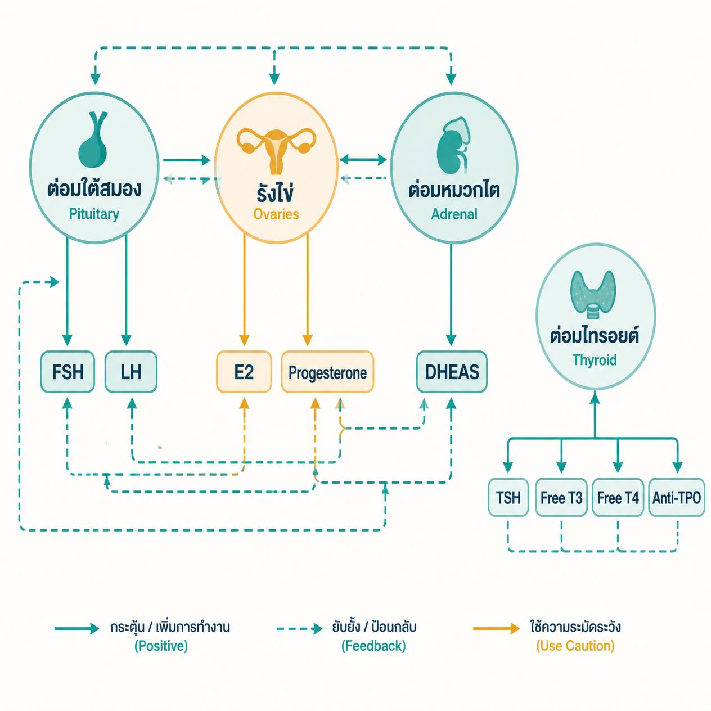
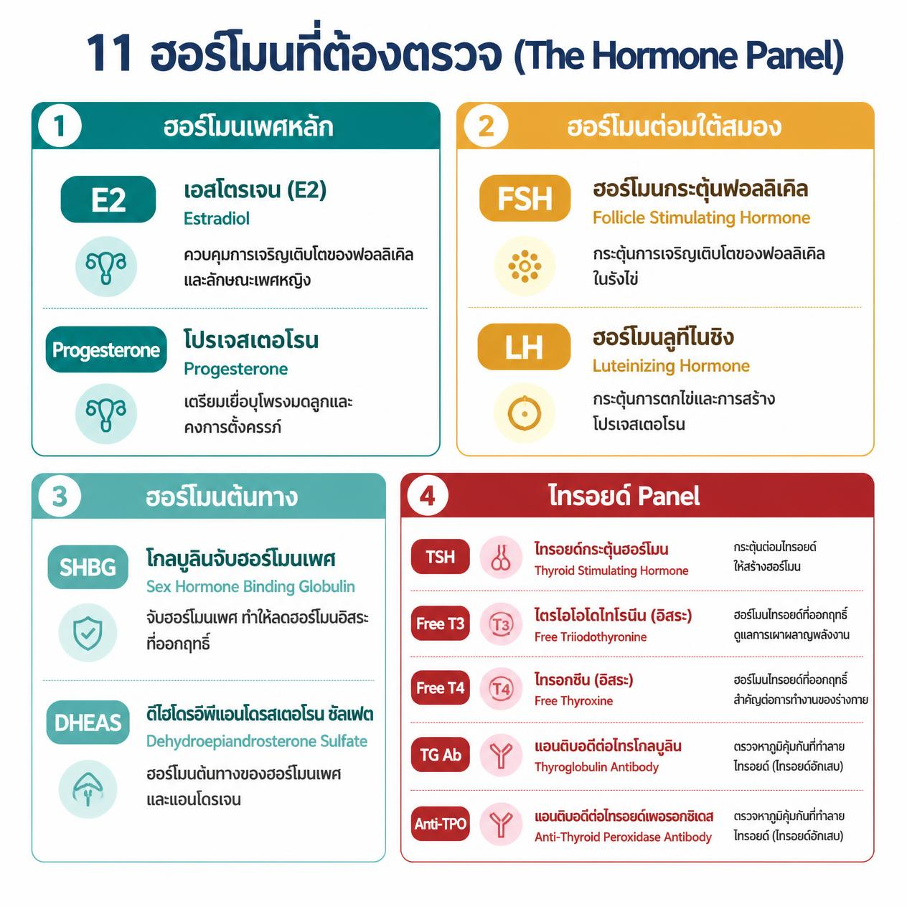
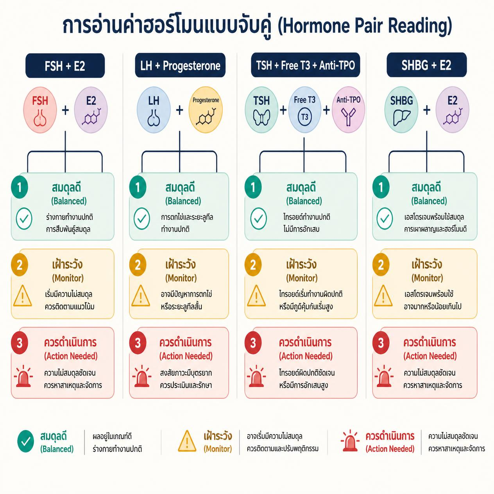

<!-- Dev note: CTA link /hormones-quiz — label "เช็กสมดุลฮอร์โมนของคุณกับ Thrive →". Wire to sticky CTA component. Must be responsive (mobile / iPad / desktop) and visible within first 3 viewport-heights on page load. -->

<!-- Hero image: female-hormone-panel-age-40-hero.webp -->

# ฮอร์โมนทำงานเป็นทีม — ทำไมผู้หญิงวัย 40 ต้องตรวจครบ ไม่ใช่แค่ 1–2 ตัว

**สรุปสั้น**
- ฮอร์โมนเพศหญิงทำงานจับคู่และพึ่งพากัน ถ้าตัวหนึ่งลด ตัวอื่นจะถูกกระทบตาม
- ผู้หญิงวัย 40 ควรตรวจฮอร์โมนอย่างน้อยปีละครั้ง เพราะ Perimenopause สามารถเริ่มได้ตั้งแต่อายุ 35–40 ปี
- Panel ที่สมบูรณ์ต้องครอบคลุม 11 ตัว: E2, Progesterone, FSH, LH, SHBG, DHEAS รวมกับไทรอยด์ (TSH, Free T3, Free T4, TG Ab, Anti-TPO)
- ตรวจแค่ 1–2 ตัวอาจพลาดต้นเหตุจริง เพราะค่าที่ "ปกติ" เดี่ยวๆ อาจผิดปกติเมื่อดูร่วมกันทั้งทีม
- เริ่มตรวจก่อนอาการจะเห็นชัด คือโอกาสที่ดีที่สุดในการชะลอความเสื่อม

**In this article**
- [ฮอร์โมนเพศหญิงไม่ได้ทำงานคนเดียว — เข้าใจ "ทีม" ก่อนตรวจ](#hormone-team)
- [อาการที่บอกว่าฮอร์โมนกำลังเสียสมดุล](#symptoms)
- [11 ตัวที่ต้องตรวจ และทำไมแต่ละตัวขาดไม่ได้](#11-hormones)
- [จับคู่ฮอร์โมน: ค่าไหนต้องดูพร้อมกันเสมอ](#hormone-pairs)
- [ตรวจปีละครั้ง หรือครึ่งปีครั้ง — ความถี่ที่เหมาะสม](#frequency)
- [Thrive ตรวจฮอร์โมนอย่างไร](#thrive-approach)
- [สิ่งที่แพทย์ Thrive พบจากเคสจริง](#doctors-say)
- [กรณีศึกษา: อาการเดียวกัน รักษาต่างกันสิ้นเชิง](#case-studies)
- [FAQ](#faq)

---

**พร้อมตรวจสมดุลฮอร์โมนของคุณแล้วหรือยัง?**
[เช็กสมดุลฮอร์โมนของคุณกับ Thrive →](/hormones-quiz)
*Thrive Wellness Center Bangkok — ตรวจครบ แปลผลโดยแพทย์ที่มีประสบการณ์จริง*

---

ผู้หญิงวัย 40 ที่ตรวจฮอร์โมนเพียง 1–2 ตัวแล้วได้รับแจ้งว่า "ปกติ" มักยังรู้สึกว่าบางอย่างไม่ใช่ — เพราะฮอร์โมนเพศหญิงทำงานเป็นระบบ ไม่ใช่รายตัว การตรวจแบบครบ Panel คือวิธีเดียวที่แพทย์จะเห็นภาพรวมได้ชัดพอที่จะวินิจฉัยตรงกับสาเหตุจริง

## ฮอร์โมนเพศหญิงไม่ได้ทำงานคนเดียว — เข้าใจ "ทีม" ก่อนตรวจ {#hormone-team}

ลองนึกภาพระบบฮอร์โมนเหมือนวงออเคสตรา แต่ละเครื่องดนตรีมีหน้าที่ของตัวเอง แต่ถ้าไวโอลินหนึ่งตัวเล่นผิดจังหวะ ทั้งวงจะได้ยินผลกระทบ ฮอร์โมนก็ทำงานในลักษณะเดียวกัน

ร่างกายของผู้หญิงผลิตฮอร์โมนเพศหลักจากสามแหล่ง: **รังไข่** (Estradiol และ Progesterone), **ต่อมหมวกไต (Adrenal Cortex)** (DHEAS) และ **ต่อมใต้สมอง (Pituitary)** (FSH และ LH) โดยมีต่อมไทรอยด์เป็นหน่วยสนับสนุนที่ถูกมองข้ามบ่อยครั้ง

**ฮอร์โมนทุกตัวในระบบนี้สื่อสารกันตลอดเวลา** เมื่อ Estradiol (E2) ลดลง ต่อมใต้สมองจะตอบสนองด้วยการเพิ่ม FSH เพื่อกระตุ้นรังไข่ให้ทำงานหนักขึ้น ค่า FSH ที่สูงขึ้นเรื่อยๆ จึงเป็นสัญญาณเตือนแรกสุดของ Perimenopause ก่อนที่ E2 จะลดลงจนสังเกตได้ด้วยอาการ [1]

> **Key finding:** งานวิจัย SWAN (Study of Women's Health Across the Nation) ซึ่งติดตามผู้หญิงกว่า 3,300 คน พบว่า FSH เริ่มสูงขึ้นก่อน E2 จะลดลงอย่างมีนัยสำคัญ และผู้หญิงแต่ละคนมี "เส้นทางฮอร์โมน" ที่แตกต่างกัน ยืนยันว่าการดูค่าเดี่ยวๆ ไม่สามารถบอกภาพรวมได้ [1]

ยิ่งไปกว่านั้น ไทรอยด์ยังถูกกระทบโดยตรงจากความผันผวนของ Estrogen เพราะ Estrogen เพิ่มการผลิตโปรตีนที่จับฮอร์โมนไทรอยด์ในเลือด เมื่อ Estrogen เริ่มแปรปรวนในช่วง Perimenopause ไทรอยด์จึงได้รับผลกระทบตามไปด้วย [4]

## อาการที่บอกว่าฮอร์โมนกำลังเสียสมดุล {#symptoms}

ช่วง Perimenopause (ระยะก่อนหมดประจำเดือน) สามารถเริ่มได้ตั้งแต่อายุ 35–40 ปี และใช้เวลา 2–8 ปีก่อนที่ประจำเดือนจะหยุดสนิท อาการในช่วงนี้มักถูกตีความผิดว่าเป็นความเครียด การนอนหลับไม่พอ หรือ "แก่ตัวตามปกติ"

**อาการที่ควรสังเกตในตัวเอง:**

- ประจำเดือนมาไม่สม่ำเสมอ — รอบสั้นลง ยาวขึ้น หรือปริมาณเปลี่ยน
- ร้อนวูบวาบหรือเหงื่อออกกลางคืน (Hot Flushes / Night Sweats)
- นอนหลับไม่ลึก ตื่นกลางดึกบ่อยขึ้น
- อารมณ์แปรปรวน หงุดหงิดง่าย วิตกกังวลโดยไม่มีสาเหตุชัด
- สมาธิสั้นลง ความจำระยะสั้นแย่ลง (Brain Fog)
- ผมร่วงมากขึ้น หรือผิวแห้งกว่าเดิม
- น้ำหนักขึ้นโดยเฉพาะรอบเอว แม้พฤติกรรมการกินไม่เปลี่ยน
- ความต้องการทางเพศลดลง หรือช่องคลอดแห้ง

> **สำคัญ:** อาการหลายอย่างข้างต้นทับซ้อนกับภาวะไทรอยด์ต่ำ (Hypothyroidism) และภาวะต่อมหมวกไตล้า (Adrenal Fatigue) ทำให้การตรวจแค่ฮอร์โมนเพศอย่างเดียวอาจพลาดต้นเหตุจริงได้ — นั่นคือเหตุผลที่ต้องตรวจทั้งระบบ

**ข้อมูลที่ควรรู้:** ประมาณ 1% ของผู้หญิงทั่วโลกเข้าสู่ Menopause ก่อนอายุ 40 ปี และอีก 5% เข้าสู่ Menopause ในช่วงอายุ 40–45 ปี [5] ตัวเลขนี้แสดงให้เห็นว่าการรอจนอาการชัดเจนก่อนตรวจอาจช้าเกินไป

## 11 ตัวที่ต้องตรวจ — และทำไมแต่ละตัวขาดไม่ได้ {#11-hormones}

| ฮอร์โมน | หน้าที่หลัก | สัญญาณเมื่อผิดปกติ |
|---|---|---|
| **Estradiol (E2)** | กระดูก ผิวพรรณ อารมณ์ สมอง | ต่ำ: กระดูกบาง วูบร้อน ผิวแห้ง / สูง: เต้านมคัด น้ำหนักขึ้น |
| **Progesterone** | สมดุล Estrogen นอนหลับ ลดวิตกกังวล | ต่ำ: นอนไม่หลับ ประจำเดือนผิดปกติ PMS รุนแรง |
| **FSH** | กระตุ้นรังไข่ผลิตไข่ | สูง: สัญญาณ Perimenopause / Menopause เริ่มต้น |
| **LH** | กระตุ้นการตกไข่ | สูง (คู่กับ FSH): รังไข่กำลังหยุดตอบสนอง |
| **SHBG** | โปรตีนจับฮอร์โมน ควบคุมปริมาณที่ใช้งานได้จริง | ต่ำ: เสี่ยงมะเร็งเต้านม เนื้องอกมดลูก [6] / สูง: E2 ที่ออกฤทธิ์จริงลดลง |
| **DHEAS** | สารตั้งต้นของ Estrogen และ Testosterone | ต่ำ: พลังงานต่ำ ภูมิคุ้มกันอ่อน กระดูกเปราะ [3] |
| **TSH** | ควบคุมการทำงานของต่อมไทรอยด์ | ผิดปกติ: น้ำหนักแปรปรวน อ่อนเพลีย หัวใจเต้นผิดจังหวะ |
| **Free T3** | ฮอร์โมนไทรอยด์ที่ออกฤทธิ์จริงในเซลล์ | ต่ำ: อ่อนล้า หนาวง่าย สมองช้า ผมร่วง |
| **Free T4** | สารตั้งต้นที่แปลงเป็น T3 | ต่ำ: บ่งบอก Hypothyroidism ที่ต้นทาง |
| **TG Ab** | ภูมิต้านทานต่อไทรอยด์ชนิดที่ 1 | บวก: บ่งบอก Hashimoto's Thyroiditis |
| **Anti-TPO** | ภูมิต้านทานต่อไทรอยด์ชนิดหลัก | บวก: โรคภูมิคุ้มกันต่อต้านไทรอยด์ พบในผู้หญิง 10–30% [4] |

**DHEAS คือตัวที่ถูกละเลยมากที่สุด** ระดับ DHEAS (ฮอร์โมนต้นทางจากต่อมหมวกไต) ลดลงประมาณ 2–5% ต่อปีหลังอายุ 30 ปี และเมื่อถึงวัย Menopause จะลดลงไปแล้วถึง 60% จากระดับสูงสุด [3] การลดลงช้าๆ นี้ทำให้อาการค่อยๆ ปรากฏและมักถูกตีว่าเป็น "แก่ตัวตามธรรมชาติ"

**Anti-TPO** ก็สำคัญไม่แพ้กัน ความชุกของแอนติบอดีชนิดนี้เพิ่มขึ้นตามอายุ และพบในผู้หญิงมากกว่าผู้ชายถึงสองเท่าในทุกช่วงอายุ [4] โรคไทรอยด์แบบ Autoimmune มักพัฒนาในช่วงอายุ 30–50 ปี ซึ่งทับซ้อนกับช่วง Perimenopause พอดี และ Anti-TPO จะตรวจพบได้ก่อนที่ TSH จะเริ่มผิดปกติ

## จับคู่ฮอร์โมน: ค่าไหนต้องดูพร้อมกันเสมอ {#hormone-pairs}

ความผิดพลาดที่พบบ่อยคือการแปลผลฮอร์โมนแต่ละตัวโดยไม่ดู context ของตัวอื่น แพทย์ที่มีประสบการณ์จะดูฮอร์โมนเหล่านี้เป็น "คู่" เสมอ:

**คู่ที่ 1: FSH + E2**
- FSH สูง + E2 ยังปกติ = รังไข่กำลังทำงานหนักขึ้นเพื่อชดเชย (Perimenopause เริ่มต้น)
- FSH สูง + E2 ต่ำ = รังไข่เริ่มตอบสนองน้อยลงอย่างมีนัยสำคัญ
- FSH ปกติ + E2 ต่ำ = อาจมีปัญหาที่แหล่งอื่น ไม่ใช่รังไข่โดยตรง [1]

**คู่ที่ 2: LH + Progesterone**
- LH สูง แต่ Progesterone ไม่ขึ้นตาม = การตกไข่ไม่สมบูรณ์ (Anovulatory Cycle)
- Progesterone ต่ำ + E2 ยังปกติ = "Estrogen Dominance" ที่ทำให้ PMS รุนแรงและนอนไม่หลับ [2]

**คู่ที่ 3: TSH + Free T3 + Free T4**
- TSH ปกติ แต่ Free T3 ต่ำ = ร่างกายแปลง T4 เป็น T3 ที่ใช้งานได้ไม่เพียงพอ
- TSH ปกติ แต่ Anti-TPO บวก = Hashimoto's ระยะแรก ก่อนที่ TSH จะเริ่มผิดปกติ [4]

**คู่ที่ 4: SHBG + E2**

SHBG (Sex Hormone Binding Globulin) หรือ "โปรตีนพาหะ" จะจับฮอร์โมนเพศไว้ ฮอร์โมนที่จับกับ SHBG จะไม่ออกฤทธิ์ได้ ดังนั้นค่า E2 รวมในเลือดอาจดูปกติ แต่ถ้า SHBG สูงมาก ปริมาณ E2 ที่ใช้งานได้จริง (Free Estradiol) จะน้อยกว่าที่ตัวเลขบอก

> **Key finding:** การดูแค่ E2 รวมโดยไม่ดู SHBG อาจทำให้แปลผลผิดพลาดได้อย่างมีนัยสำคัญ โดยเฉพาะในผู้หญิงที่มีน้ำหนักตัวน้อยหรือรับประทานอาหารมังสวิรัติ ซึ่งมักมี SHBG สูงกว่าปกติ [6]

## ตรวจปีละครั้ง หรือครึ่งปีครั้ง — ความถี่ที่เหมาะสม {#frequency}

ฮอร์โมนไม่ใช่ค่าคงที่ มันเปลี่ยนแปลงตามรอบเดือน ตามอายุ และตามสภาวะร่างกาย การตรวจครั้งเดียวจึงให้ภาพเพียงชั่วขณะ ไม่ใช่แนวโน้มที่แท้จริง

| สถานการณ์ | ความถี่ที่แนะนำ |
|---|---|
| อายุ 35–40 ปี ยังไม่มีอาการ | ทุก 1–2 ปี เพื่อสร้าง Baseline ส่วนตัว |
| อายุ 40–45 ปี หรือมีอาการเริ่มต้น | ปีละครั้ง |
| กำลังอยู่ใน Perimenopause | ทุก 6 เดือน |
| รับฮอร์โมนบำบัด (HRT / BHRT) | ทุก 3–6 เดือน เพื่อ Monitor ผล |

**ทำไม Baseline ถึงสำคัญมาก?**

เมื่อแพทย์มีค่าฮอร์โมน "ปกติของคุณ" จากช่วงที่สุขภาพดี การเปรียบเทียบกับผลตรวจในอนาคตจะบอกได้ชัดว่ามีการเปลี่ยนแปลงหรือไม่ ต่างจากการพึ่ง "ค่าอ้างอิงห้องแลป" ที่เป็นช่วงกว้างสำหรับประชากรทั่วไป ไม่ใช่สำหรับคุณโดยเฉพาะ

การศึกษาจากโรงพยาบาลศิริราช มหาวิทยาลัยมหิดล ซึ่งติดตามผู้หญิงไทยวัย Peri/Postmenopause พบว่าระดับ FSH และ E2 ในผู้หญิงไทยมีความแปรปรวนสูงในช่วง Perimenopause ยืนยันความสำคัญของการติดตามค่าต่อเนื่อง ไม่ใช่ตรวจครั้งเดียวแล้วตัดสิน [7]

> **ควรปรึกษาแพทย์ก่อนเสมอ** เกี่ยวกับ Timing ของการตรวจและการแปลผล โดยเฉพาะถ้าคุณมีประวัติโรคต่อมไทรอยด์ โรคภูมิคุ้มกัน หรืออยู่ระหว่างการรักษาด้วยยาฮอร์โมน

## Thrive ตรวจฮอร์โมนอย่างไร {#thrive-approach}

Thrive Wellness Center ใช้การตรวจ Comprehensive Hormone Panel ที่ครอบคลุม 11 ตัวในการเจาะเลือดครั้งเดียว ได้แก่ Estradiol (E2), Progesterone, FSH, LH, SHBG, DHEAS, TSH, Free T3, Free T4, TG Ab และ Anti-TPO

**ขั้นตอน:**

1. **นัดหมายและเตรียมตัว** — แพทย์แนะนำเวลาที่เหมาะสมของรอบเดือนสำหรับการเจาะ (วันที่ 2–5 ให้ผล FSH/E2 แม่นยำที่สุดสำหรับผู้หญิงที่ยังมีประจำเดือน)
2. **เจาะเลือด** — ใช้เวลาประมาณ 10–15 นาที ไม่ต้องอดอาหาร
3. **รอผล** — ประมาณ 3–5 วันทำการ
4. **แปลผลกับแพทย์** — ไม่ใช่แค่ดูว่า "อยู่ในช่วงปกติไหม" แต่แปลผลเป็น Pattern และวางแผนแบบ Personalized สำหรับคุณโดยเฉพาะ

ความแตกต่างอยู่ที่ขั้นตอนสุดท้าย แพทย์ที่มีประสบการณ์จากเคสจริงจำนวนมากจะเห็น Pattern ที่ค่าตัวเลขเพียงอย่างเดียวไม่สามารถบอกได้

## สิ่งที่แพทย์ Thrive พบจากเคสจริง {#doctors-say}

> *"เคสที่ยากที่สุดคือผู้หญิงที่ตรวจฮอร์โมนมาแล้วและได้รับแจ้งว่า 'ปกติ' ทุกตัว แต่ยังรู้สึกว่ามีบางอย่างไม่ใช่ เมื่อเราตรวจ Panel เต็มและดู Pattern ร่วมกัน มักพบว่า FSH เริ่มขยับขึ้นแม้ E2 ยังอยู่ในช่วงอ้างอิง หรือ Anti-TPO บวกอยู่แต่ TSH ยังดูปกติ นั่นคือสัญญาณเตือนที่ต้องจัดการก่อนที่ทุกอย่างจะแย่ลง"*
>
> — พญ. ชนากานต์ ตระหง่านศรี (หมอนุ่น), Thrive Wellness Center

**Pattern ที่พบบ่อยในคลินิก:**

- **Progesterone ต่ำแบบ Subclinical** — เกิดก่อน E2 ลด ทำให้นอนไม่หลับและวิตกกังวลก่อนอาการวัยทองชัดเจน คนไข้หลายคนตรวจ E2 มาแล้วได้ "ปกติ" แต่ Progesterone ต่ำจนอธิบายอาการทั้งหมดได้ [2]
- **DHEAS ต่ำกว่าค่าเฉลี่ยอายุเดียวกันอย่างมีนัยสำคัญ** — แต่ยังอยู่ใน "ช่วงปกติ" ของห้องแลป คนไข้รู้สึกเพลีย ฟื้นตัวช้า แต่ตรวจที่อื่นแล้วได้รับแจ้งว่าปกติ
- **Hashimoto's ระยะแรก** — ตรวจพบจาก Anti-TPO บวกก่อนที่ TSH จะผิดปกติ ซึ่ง Anti-TPO ไม่อยู่ใน "Hormone Panel" ทั่วไปของโรงพยาบาลหลายแห่ง

> **Key finding:** การตรวจพบและจัดการกับค่าที่เริ่มเบี่ยงเบนตั้งแต่เนิ่นๆ มีหลักฐานว่าช่วยชะลอการเสื่อมของกระดูก หัวใจ และการทำงานของสมองได้อย่างมีนัยสำคัญ [1][5] — แต่ต้องตรวจก่อนที่ความเสียหายจะสะสมจนถึงจุดที่ยากจะกลับคืน

---

## กรณีศึกษา: อาการเดียวกัน รักษาต่างกันสิ้นเชิง {#case-studies}

สองเคสด้านล่างนี้แสดงให้เห็นว่าทำไมการตรวจครบ Panel ถึงเปลี่ยนผลลัพธ์การรักษาได้อย่างสิ้นเชิง — แม้อาการภายนอกจะดูคล้ายกัน

> *เคสเหล่านี้ได้รับการ anonymize เพื่อความเป็นส่วนตัว การรักษาแตกต่างกันในแต่ละบุคคล ควรปรึกษาแพทย์ก่อนเสมอ*

---

### เคส 1 — คุณ ก. อายุ 40 นักธุรกิจ ประจำเดือนยังมาปกติ

**อาการ:** ร้อนวูบวาบ น้ำหนักพุ่งขึ้น ตัวบวม — แม้ประจำเดือนมาสม่ำเสมอ

**ผลตรวจที่โดดเด่น:**

| กลุ่ม | ตัวที่ผิดปกติ | ความหมาย |
|---|---|---|
| **สูงกว่าปกติ** | E2, LH, FSH, Testosterone | E2 สูง = ร่างกายมี Estrogen มากเกิน ทำให้ตัวบวมและเก็บไขมัน |
| **ต่ำกว่าปกติ** | Progesterone, Iron, Vitamin D3, CoQ10, Lycopene, Chromium, Folic | Progesterone ต่ำ = ไม่มีตัวถ่วงดุล Estrogen |
| **ปกติ** | PTH, ต่อมหมวกไต, Growth Hormone | — |

**สิ่งที่เกิดขึ้นในร่างกาย:**

E2 สูง + Progesterone ต่ำ = ภาวะ **Estrogen Dominance** (ฮอร์โมน Estrogen ครอบงำโดยไม่มีตัวถ่วง) LH และ FSH สูงด้วย หมายความว่าต่อมใต้สมอง "รู้สึก" ว่ายังไม่ได้รับสัญญาณ feedback ที่ถูกต้อง และยังพยายามกระตุ้นระบบอยู่

> **Key teaching point:** แม้ประจำเดือนจะมาปกติ แต่ฮอร์โมนไม่สมดุล — นี่คือเหตุผลที่อาการ "วัยทอง" เช่น ร้อนวูบวาบ เกิดได้แม้ยังอยู่ในวัยเจริญพันธุ์ และ **ถ้าตรวจแค่ FSH จะเห็นว่าสูง แล้วสรุปผิดว่าเป็น Menopause ทั้งที่ E2 สูงอยู่**

**แนวทางที่แพทย์วางแผน:** เสริม Progesterone เพื่อสร้างสมดุลกับ E2 (วันที่ 16–30 ของรอบเดือน) ร่วมกับปรับสารอาหารที่ขาด และแนะนำกินผักหลากสีเพื่อช่วยกำจัด Estrogen ส่วนเกินผ่านตับ

---

### เคส 2 — คุณผึ้ง อายุ 43 มีลูกหนึ่งคน พาหะธาลัสซีเมีย

**อาการ:** เหนื่อยง่าย นอนหลับยาก ออกกำลังกายหนักไม่ได้ (มักป่วยหลัง) ประจำเดือนยังมา

**ผลตรวจที่โดดเด่น:**

| กลุ่ม | ตัวที่ผิดปกติ | ความหมาย |
|---|---|---|
| **สูงกว่าปกติ** | FSH, LH, TgAb, Ferritin (130 จาก 60.7 ปีก่อน) | FSH/LH พุ่ง = รังไข่ไม่ตอบสนองแล้ว |
| **ต่ำแทบไม่มี** | E2, Progesterone (ปีที่แล้วยังปกติ) | หมดลงใน 1 ปี |
| **ต่ำ** | Serum Iron 49 (ปีที่แล้ว 157) | ลดลงกว่า 3 เท่าในปีเดียว |
| **ปกติ** | CBC อื่นๆ, BUN, Creatinine, Lipid, Anti-TPO, TSH, DHEAS, Cortisol, Ferritin (ยังอยู่ใน range) | — |

**สิ่งที่ซ่อนอยู่ในค่า "ปกติ":**

**1. Iron ต่ำ + Ferritin สูงขึ้น = อย่าเพิ่งเสริมเหล็กอย่างเดียว**

Serum Iron ต่ำบอกว่า "เหล็กในเลือดน้อย" แต่ Ferritin ที่สูงขึ้นจาก 60 → 130 บอกว่า "การอักเสบในร่างกายกำลังเพิ่มขึ้น" เพราะ Ferritin ทำหน้าที่เป็นโปรตีนเก็บเหล็ก แต่ยังเป็นตัวบ่งชี้การอักเสบด้วย

> **ถ้าเสริมเหล็กอย่างเดียวโดยไม่จัดการการอักเสบ — Ferritin จะยิ่งพุ่งสูง และอาการอักเสบจะแย่ลง** ต้องเสริมเหล็กควบคู่กับ Anti-oxidant เสมอ

**2. TgAb สูง แต่ Anti-TPO ปกติ = ไทรอยด์ Autoimmune ระยะแรก**

ถ้าตรวจแค่ Anti-TPO (ซึ่งเป็น marker หลักในแพ็กเกจทั่วไป) จะได้ "ปกติ" และพลาด TgAb ที่สูง ซึ่งเป็นสัญญาณเตือนล่วงหน้าของ Hashimoto's Thyroiditis ก่อนที่ TSH จะเริ่มผิดปกติ

**3. ฮอร์โมนเพศหมดใน 1 ปี — ถ้าไม่ตรวจทุกปีจะไม่เห็นการเปลี่ยนแปลง**

E2 และ Progesterone ที่ปกติปีที่แล้ว กลายเป็น "แทบไม่มีเลย" ในปีนี้ โดยที่ประจำเดือนยังมา การรอจน "หมดประจำเดือนก่อนแล้วค่อยตรวจ" จึงสายเกินไป

> **Key teaching point:** ประจำเดือนมา ≠ ฮอร์โมนปกติ คุณผึ้งยังมีประจำเดือด แต่ฮอร์โมน E2/Progesterone ต่ำแทบไม่มีเลย — ถ้าปล่อยไว้ อาการวัยทองเต็มรูปแบบจะตามมาภายใน 1–2 ปี

**แนวทางที่แพทย์วางแผน:** เสริมธาตุเหล็ก + Anti-oxidant พร้อมกัน, ฟื้นฟูฮอร์โมนเพศ, ตรวจ Vitamin D เพิ่มเติม (มีแนวโน้มขาดเพราะร่างกายนำไปใช้สร้างฮอร์โมน), ติดตาม TgAb ทุก 6 เดือน

---

### สรุปความต่างของสองเคส — ทำไม Panel ครบถึงสำคัญ

| | คุณ ก. (อายุ 40) | คุณผึ้ง (อายุ 43) |
|---|---|---|
| **E2** | สูง | ต่ำแทบไม่มี |
| **Progesterone** | ต่ำ | ต่ำแทบไม่มี |
| **FSH / LH** | สูง | สูงมาก |
| **การวินิจฉัย** | Estrogen Dominance | Perimenopause เต็มรูปแบบ |
| **แนวทางรักษา** | เพิ่ม Progesterone เพื่อถ่วงดุล | ฟื้นฟูทั้งระบบ |
| **ถ้าตรวจแค่ FSH** | จะสรุปผิดว่าเป็น Menopause | จะพลาด Iron/Ferritin complex |
| **ถ้าตรวจแค่ E2** | จะพลาดว่า Progesterone ต่ำ | จะพลาด TgAb |

**อาการภายนอกของทั้งสองคนคล้ายกัน แต่ต้นเหตุและการรักษาต่างกันสิ้นเชิง** — นั่นคือสิ่งที่เกิดขึ้นเมื่อตรวจแค่ 1–2 ตัวแล้วสรุปผล

---

## FAQ {#faq}

**ผู้หญิงวัย 40 ควรตรวจฮอร์โมนอะไรบ้าง?**
Panel ขั้นต่ำที่ให้ภาพครบคือ: Estradiol (E2), Progesterone, FSH, LH, SHBG, DHEAS รวมกับ Thyroid Panel (TSH, Free T3, Free T4, TG Ab, Anti-TPO) รวม 11 ตัว การตรวจแค่ FSH หรือ E2 เพียงตัวเดียวไม่เพียงพอสำหรับการวินิจฉัยที่แม่นยำ เพราะฮอร์โมนทำงานเป็นทีม

**FSH สูง หมายความว่าอะไร?**
FSH (Follicle Stimulating Hormone) หรือ ฮอร์โมนกระตุ้นรังไข่ ที่สูงขึ้นหมายความว่าต่อมใต้สมองกำลังส่งสัญญาณกระตุ้นรังไข่อย่างหนักขึ้น ซึ่งมักเกิดเมื่อรังไข่ตอบสนองน้อยลง ในช่วง Perimenopause FSH จะสูงขึ้นก่อน E2 จะลดลงอย่างชัดเจน [1] ดังนั้น FSH สูงในวัย 40 คือสัญญาณเตือนที่ควรรับรู้ก่อนอาการจะปรากฏ

**ฮอร์โมนเอสโตรเจน (Estradiol) ต่ำมีอาการอย่างไร?**
Estradiol (E2) ต่ำแสดงออกหลายรูปแบบ: ร้อนวูบวาบ เหงื่อออกกลางคืน นอนไม่หลับ อารมณ์แปรปรวน ผิวแห้ง ช่องคลอดแห้ง ผมร่วง และกระดูกเริ่มบางลง ในระยะยาว E2 ต่ำเพิ่มความเสี่ยงโรคกระดูกพรุนและโรคหัวใจอย่างมีนัยสำคัญ [5]

**Perimenopause เริ่มตั้งแต่อายุเท่าไหร่?**
ช่วง Perimenopause (ระยะเปลี่ยนผ่านก่อนหมดประจำเดือน) สามารถเริ่มได้ตั้งแต่อายุ 35–40 ปี และกินเวลา 2–8 ปี อาการในระยะแรกมักเบาและไม่ชัดเจน เช่น รอบเดือนเริ่มเปลี่ยน นอนหลับยากขึ้น หรืออารมณ์แปรปรวนมากกว่าเดิม การตรวจ Hormone Panel ช่วยยืนยันได้ก่อนอาการจะรุนแรง

**SHBG กับ DHEAS ตรวจทำไม สำคัญแค่ไหน?**
SHBG (Sex Hormone Binding Globulin) หรือโปรตีนพาหะฮอร์โมน ควบคุมว่าฮอร์โมนเพศที่ "ออกฤทธิ์ได้จริง" ในร่างกายมีปริมาณเท่าไหร่ ระดับ SHBG ต่ำสัมพันธ์กับความเสี่ยงมะเร็งเต้านมและเนื้องอกมดลูกที่สูงขึ้น [6] ส่วน DHEAS (Dehydroepiandrosterone sulfate) เป็นสารตั้งต้นของฮอร์โมนเพศหลายชนิดจากต่อมหมวกไต ระดับที่ต่ำเกินไปเชื่อมโยงกับภูมิคุ้มกันอ่อน กระดูกเปราะ และพลังงานต่ำ [3]

**ตรวจฮอร์โมนต้องเจาะเลือดวันไหนของรอบเดือน?**
สำหรับผู้หญิงที่ยังมีประจำเดือน วันที่ 2–5 ของรอบเดือนให้ผล FSH, LH, และ E2 ที่แม่นยำที่สุด ส่วน Progesterone ควรตรวจในช่วงกลางรอบ (วันที่ 19–21) เพื่อดูว่ามีการตกไข่และ Progesterone ขึ้นเพียงพอหรือไม่ แพทย์ Thrive จะแนะนำ Timing ที่เหมาะสมก่อนนัดตรวจเสมอ

---

**พร้อมตรวจสมดุลฮอร์โมนของคุณแล้วหรือยัง?**
[เช็กสมดุลฮอร์โมนของคุณกับ Thrive →](/hormones-quiz)
*Thrive Wellness Center — The Crystal Park ชั้น 2 ลาดพร้าว | เปิดทุกวัน 10:00–19:00*
*LINE @thrivewellnessth | โทร 095-934-9640*

---

## References

[1] Randolph JF Jr, et al. (2011). Trajectory clustering of estradiol and follicle-stimulating hormone during the menopausal transition among women in the Study of Women's Health across the Nation (SWAN). *Menopause*, 18(12), 1309–1317. https://pmc.ncbi.nlm.nih.gov/articles/PMC3410268/

[2] Prior JC, et al. (2023). Oral micronized progesterone for perimenopausal night sweats and hot flushes: a Phase III Canada-wide randomized placebo-controlled 4-month trial. *Menopause*, 30(6), 595–605. https://pmc.ncbi.nlm.nih.gov/articles/PMC10241804/

[3] Crawford SL, et al. (2012). Menopausal transition stage-specific changes in circulating adrenal androgens. *Menopause*, 19(6), 658–666. https://pmc.ncbi.nlm.nih.gov/articles/PMC3366025/

[4] Sorrenti S, et al. (2023). Autoimmune Thyroid Disease in Women. *International Journal of Environmental Research and Public Health*, 20(5), 3786. https://pmc.ncbi.nlm.nih.gov/articles/PMC10071442/

[5] Luoto R, et al. (2010). Premature menopause or early menopause: long-term health consequences. *Maturitas*, 67(2), 91–96. https://pmc.ncbi.nlm.nih.gov/articles/PMC2815011/

[6] Wen Y, et al. (2024). Low levels of sex hormone-binding globulin predict an increased breast cancer risk and its underlying molecular mechanisms. *Frontiers in Oncology*, 14, 1249596. https://pmc.ncbi.nlm.nih.gov/articles/PMC10921478/

[7] Rattanachaiyanont M, et al. (2006). Serum follicle stimulating hormone and estradiol in peri/postmenopausal women attending Siriraj Menopause Clinic: a retrospective study. *Journal of the Medical Association of Thailand*, 89(11), 1798–1804. PMID: 17048416.

[8] Ehlert U, et al. (2022). Steroid Hormone Secretion Over the Course of the Perimenopause: Findings From the Swiss Perimenopause Study. *Frontiers in Endocrinology*, 12, 799789. https://pmc.ncbi.nlm.nih.gov/articles/PMC8712488/

---

## Image Prompts

| # | Filename | Size | Placement | Prompt |
|---|---|---|---|---|
| Hero | `female-hormone-panel-age-40-hero.webp` | 1200×630 | Above H1 | A Thai woman in her early 40s sitting alone at a warm, sunlit Bangkok café in the morning, holding a coffee cup with both hands, gazing thoughtfully out the window. Soft golden natural light, slightly bokeh background with city greenery. Editorial photography feel — warm teal and amber colour grade. She looks quietly reflective and health-aware, not sick or worried. No clinical setting, no stethoscopes, no pills. No stock-photo clichés. 1200×630px landscape. |
| Inline 1 | `female-hormone-panel-age-40-diagram-1.webp` | 1000×500 | After H2: ฮอร์โมนทำงานเป็นทีม | Clean flat-vector medical diagram on off-white background showing the hormone team network. Three source nodes at the top: "ต่อมใต้สมอง (Pituitary)" in deep teal, "รังไข่ (Ovaries)" in warm amber, "ต่อมหมวกไต (Adrenal)" in soft teal. Arrows flowing down to hormone labels: FSH, LH (from Pituitary); E2, Progesterone (from Ovaries); DHEAS (from Adrenal). A separate "ต่อมไทรอยด์ (Thyroid)" node on the right with TSH / Free T3 / Free T4 / Anti-TPO. Bidirectional arrows showing feedback loops between nodes. Thai primary labels, small English subtitle below each. Thrive palette: teal #2A9D8F positive states, amber caution, deep navy text. No people, no hands, no stock gradients. 1000×500px. |
| Inline 2 | `female-hormone-panel-age-40-infographic.webp` | 1000×600 | After H2: 11 ตัวที่ต้องตรวจ | Flat-vector infographic on clean white background. Title at top: "11 ฮอร์โมนที่ต้องตรวจ (The Hormone Panel)" in dark navy. Four colour-coded groups arranged in 2×2 grid: Group 1 teal "ฮอร์โมนเพศหลัก" (E2, Progesterone); Group 2 amber "ฮอร์โมนต่อมใต้สมอง" (FSH, LH); Group 3 soft teal "ฮอร์โมนต้นทาง" (SHBG, DHEAS); Group 4 deep red "ไทรอยด์ Panel" (TSH, Free T3, Free T4, TG Ab, Anti-TPO). Each hormone shown as a labelled pill/badge icon with Thai name primary, English subtitle small. Brief one-line function note below each. No people, no hands, no generic gradients. 1000×600px. |
| Inline 3 | `female-hormone-panel-age-40-flowchart.webp` | 1200×450 | After H2: จับคู่ฮอร์โมน | Clean flat-vector horizontal flowchart on off-white background. Title: "การอ่านค่าฮอร์โมนแบบจับคู่ (Hormone Pair Reading)" in dark navy. Four vertical columns, each a pair: Column 1 "FSH + E2" with 3-branch decision tree showing 3 scenario combinations and their Thai-labelled meaning; Column 2 "LH + Progesterone" same structure; Column 3 "TSH + Free T3 + Anti-TPO"; Column 4 "SHBG + E2". Branch outcomes colour-coded: green teal = reassuring, amber = watch, deep red = action needed. Thai primary labels, small English subtitle. No people, no stock art. 1200×450px. |

---

## Thrive QA Checklist

- [x] Blog post follows skeleton order (T0): Hero → TL;DR → TOC → CTA-Top → Intro → Body H2s → Doctors Say → FAQ → CTA-Bottom → References
- [x] CTA identified (T0.1): `/hormones-quiz` — "เช็กสมดุลฮอร์โมนของคุณกับ Thrive →"
- [x] Dev note included at top of deliverable: CTA link + label + sticky component reminder
- [x] TL;DR summary box at top (5 bullets)
- [x] Table of Contents included ("In this article") linking to every H2
- [x] Image prompts table included (T5.1): 1 hero + 3 inline, all with Thrive brand colors, Thai labels, file names, and sizes
- [x] CTA block appears in Top position (within first 3 visible elements)
- [x] CTA block appears in Bottom position (after FAQ, before References)
- [x] 8 citations, full references listed (includes Thai-institution source [7] from Mahidol/Siriraj)
- [x] All jargon explained in plain language on first use
- [x] Bold key finding in each major section
- [x] 2 callout boxes (Key finding x2 + clinical warning x1)
- [x] FAQ section with 6 realistic patient questions
- [x] Anti-clickbait gate passed — no unverified superlatives, no fear-based urgency
- [x] All absolute cure claims removed or qualified with "may help", "associated with", "evidence suggests"
- [x] Direct-answer paragraph in first 2 sentences (GEO signal)
- [x] "สิ่งที่แพทย์ Thrive พบจากเคสจริง" section included (practitioner voice)
- [x] Unique angle confirmed: "ฮอร์โมนทำงานเป็นทีม" + จับคู่ฮอร์โมน concept not found in top-ranking generic hospital content
- [x] "ควรปรึกษาแพทย์ก่อน" disclaimer added where clinically appropriate
