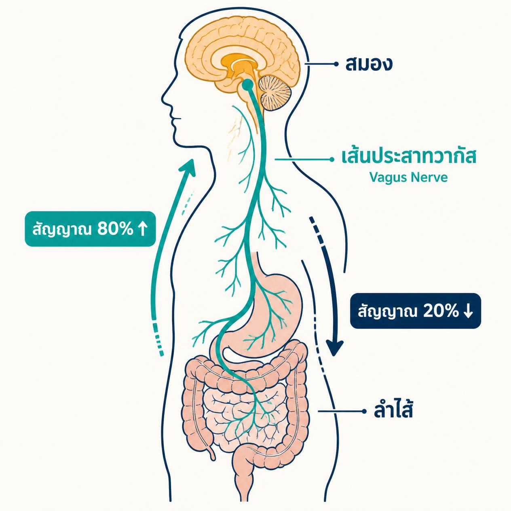
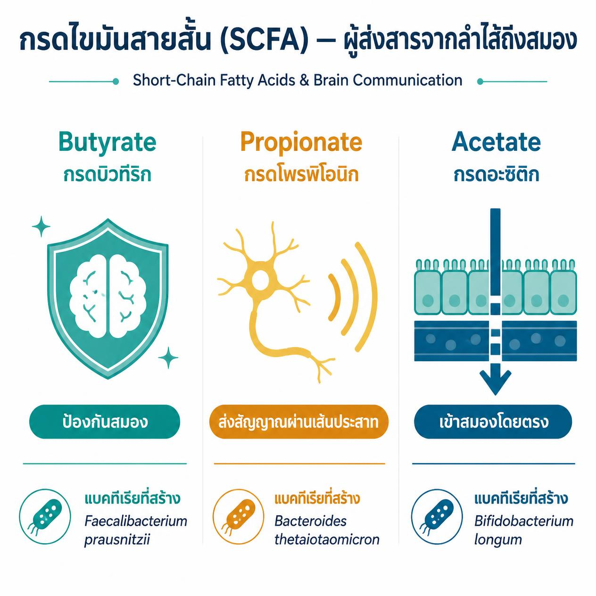
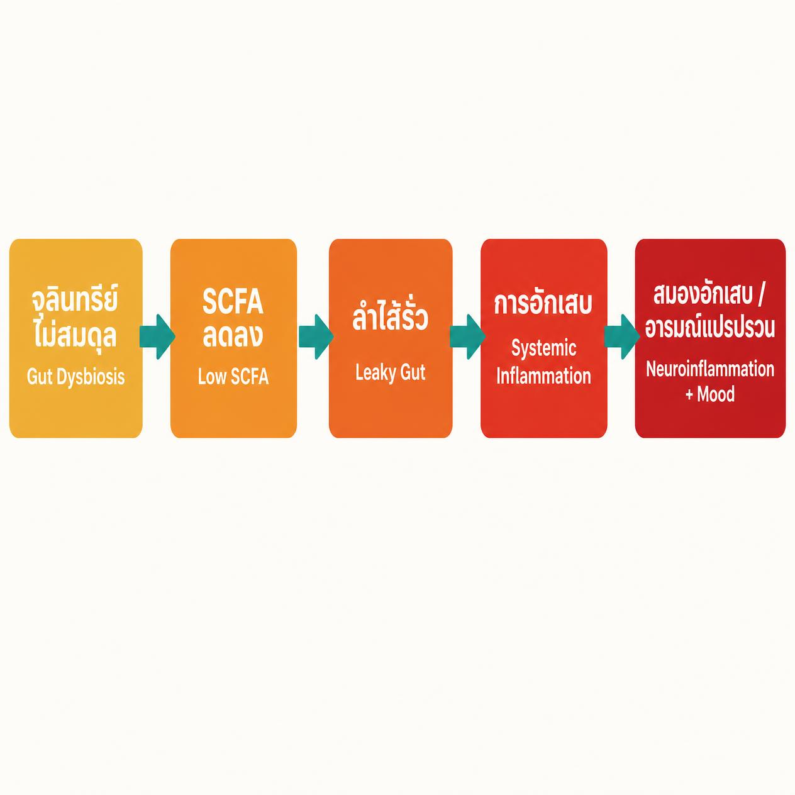

# แบคทีเรียในลำไส้ส่งผลต่อสมองอย่างไร? ความลับของ 'สมองที่สอง'

<!-- SEO Metadata -->
<!-- Title tag: แบคทีเรียในลำไส้ส่งผลต่อสมอง: วิทยาศาสตร์ 'สมองที่สอง' (54 chars) -->
<!-- Meta description: แบคทีเรียในลำไส้ส่งผลต่อสมองและอารมณ์อย่างไร? เข้าใจกลไก SCFA และ gut-brain axis เบื้องหลัง 'สมองที่สอง' พร้อมวิธีตรวจสมดุลลำไส้ที่ Thrive Bangkok (138 chars) -->
<!-- URL slug: /blog/gut-bacteria-brain-connection -->
<!-- Target keyword: แบคทีเรียในลำไส้ส่งผลต่อสมองอย่างไร -->
<!-- Secondary keywords: กรดไขมันสายสั้น SCFA, สมองที่สอง, จุลินทรีย์ในลำไส้กับอารมณ์, gut-brain axis ภาษาไทย, ลำไส้รั่วส่งผลต่อสุขภาพจิต -->
<!-- Author: ทีมแพทย์เวชศาสตร์เชิงฟังก์ชัน, Thrive Wellness Center -->
<!-- Date published: 2026-06-08 -->
<!-- Date modified: 2026-06-08 -->

<!-- DEV NOTE: CTA link = /urine-organic-test | Label = "ตรวจ Organic Acids Test ที่ Thrive →"
     Secondary internal links: /food-intolerance (leaky gut angle), /post/อาหารที่มี-probiotic (existing post)
     Wire primary CTA to sticky CTA component. Responsive mobile/iPad/desktop.
     Visible within first 3 viewport-heights on page load.
     Set ctaService field in Sanity to: Urine Organic Test service document. -->

<!-- INTERNAL LINKING PLAN:
     Link TO this page from: /urine-organic-test (anchor: "กรดไขมันสายสั้น SCFA"),
       /food-intolerance (anchor: "ลำไส้รั่วและการอักเสบในสมอง"),
       /post/อาหารที่มี-probiotic (add in-content link to this new post)
     This page links to: /urine-organic-test (×2 CTA), /post/อาหารที่มี-probiotic (×1 in-content) -->

---

<!-- IMAGE PROMPT (Hero — lifestyle editorial 1200×630px):
A Thai woman in her late 30s sitting in a warm Bangkok café in the early morning,
holding a cup of tea with both hands and gazing thoughtfully out the window. She
looks calm and health-conscious — not sick, not worried, just quietly curious.
Lifestyle editorial photography style. Warm amber and teal light, natural morning
glow through sheer curtains, Bangkok street scene softly blurred in the background.
Warm teal #2A9D8F colour grade with soft amber highlights. The mood is quiet
curiosity: she is thinking, not suffering. No stethoscopes, no pill bottles, no
white hospital backgrounds, no obvious AI-generated faces, no stock-photo
handshakes. 1200×630px landscape.
-->

---

**Quick Summary**
- แบคทีเรียในลำไส้ส่งผลต่อสมองผ่าน 4 เส้นทางพร้อมกัน — และสัญญาณกว่า 80% วิ่งจากลำไส้ขึ้นสู่สมอง ไม่ใช่ลงมา [1]
- กรดไขมันสายสั้น (SCFA) คือสารเคมีที่แบคทีเรียดีผลิตจากการย่อยใยอาหาร — มันสามารถข้ามเข้าสมองได้โดยตรง [1]
- กว่า 90% ของเซโรโทนิน (สารแห่งความสุข) ถูกผลิตในลำไส้ ไม่ใช่ในสมอง [3]
- งานวิจัยในผู้ป่วยไทยที่มีภาวะซึมเศร้าพบระดับแบคทีเรียผู้ผลิต SCFA ต่ำกว่าคนปกติอย่างมีนัยสำคัญ [6]
- การตรวจ Organic Acids Test (OAT) วัดได้ว่าลำไส้กำลังส่งสารอะไรไปยังสมองของคุณบ้าง

---

**In this article**
- [สมองที่สองคืออะไร?](#second-brain)
- [4 เส้นทางการสื่อสารระหว่างลำไส้กับสมอง](#pathways)
- [กรดไขมันสายสั้น (SCFA) — ผู้ส่งสารจากลำไส้ถึงสมอง](#scfa)
- [เมื่อจุลินทรีย์ไม่สมดุล: อาการที่ควรรู้](#dysbiosis)
- [เมื่อไหร่ควรตรวจสุขภาพลำไส้?](#when-to-test)
- [Thrive ช่วยฟื้นฟูสมดุลลำไส้อย่างไร](#thrive-approach)
- [สิ่งที่แพทย์ Thrive บอก](#doctors-say)
- [FAQ](#faq)

---

**แบคทีเรียในลำไส้ส่งผลต่อสมองผ่านระบบสื่อสารสองทิศทางที่เรียกว่า Gut-Brain Axis โดยอาศัยเส้นประสาทวากัส (Vagus Nerve) ฮอร์โมน ระบบภูมิคุ้มกัน และสารเคมีที่แบคทีเรียผลิตขึ้นชื่อว่ากรดไขมันสายสั้น (Short-Chain Fatty Acids หรือ SCFA) ซึ่งสามารถเข้าถึงสมองได้โดยตรง [1]** งานวิจัยจาก Frontiers in Neuroscience (2023) และการทบทวนงานวิจัยอย่างเป็นระบบใน PubMed (2025) ยืนยันว่าความไม่สมดุลของจุลินทรีย์ในลำไส้เชื่อมโยงโดยตรงกับความเสี่ยงโรคซึมเศร้า วิตกกังวล และการอักเสบในสมอง [1][5]

---

**พร้อมรู้ว่าลำไส้กำลังส่งสารอะไรไปยังสมองคุณบ้าง?**
[ตรวจ Organic Acids Test ที่ Thrive →](/urine-organic-test)
*Thrive Wellness Center Bangkok — วิทยาศาสตร์เชิงฟังก์ชัน ดูแลเฉพาะบุคคล*

---

## สมองที่สองคืออะไร? {#second-brain}

<!-- IMAGE PROMPT (Inline 1 — medical diagram 1000×500px):
Flat-vector medical diagram on clean off-white background showing the human torso
in side profile. The brain (top) and gut/intestines (bottom) are connected by a
prominent Vagus Nerve illustrated as a bold teal #2A9D8F line. An arrow overlay
shows 80% of signals travelling upward from gut to brain, and 20% downward. Thai
primary labels on every element: "สมอง" (brain), "เส้นประสาทวากัส" with small English
subtitle "Vagus Nerve", "ลำไส้" (gut), "สัญญาณ 80% ↑" label on the nerve. Color:
teal #2A9D8F for positive/upward signals; deep navy for anatomical line work; warm
amber highlights for the brain region. No stock-photo people, no photographic
elements, no generic gradients. 1000×500px.
-->

คนส่วนใหญ่รู้ว่าลำไส้กับสมองมีความเชื่อมโยงกัน — แต่น้อยคนที่รู้ว่า **ลำไส้มีเซลล์ประสาทมากกว่า 500 ล้านเซลล์** ซึ่งมากกว่าที่พบในไขสันหลังเสียอีก [1] ระบบประสาทในลำไส้นี้เรียกว่า Enteric Nervous System (ENS) และสามารถทำงานอิสระจากสมองได้ในระดับหนึ่ง นักประสาทวิทยาศาสตร์จึงเรียกมันว่า "สมองที่สอง" (Second Brain)

แต่สิ่งที่บทความไทยส่วนใหญ่ไม่ได้บอกคือ: สมองที่สองนี้ไม่ได้เป็นแค่ "ผู้รับคำสั่ง" จากสมองหลัก — มันส่งสัญญาณกลับขึ้นไปอย่างต่อเนื่องเช่นกัน และสัญญาณส่วนใหญ่มาจากสิ่งมีชีวิตขนาดจิ๋วที่อาศัยอยู่ในลำไส้ของคุณ นั่นคือจุลินทรีย์หรือแบคทีเรีย

สำหรับชาวกรุงเทพที่ใช้ชีวิตเร่งรีบ ทานอาหารนอกบ้าน และเจ็บป่วยบ่อยจนต้องกินยาปฏิชีวนะ ความไม่สมดุลของจุลินทรีย์ในลำไส้เป็นเรื่องที่ใกล้ตัวกว่าที่คิด และมันส่งผลถึงอารมณ์และการทำงานของสมองโดยตรง

> **สถิติน่ารู้:** ระบบประสาทในลำไส้มีเซลล์ประสาทมากกว่า 500 ล้านเซลล์ และมีเส้นใยประสาทเชื่อมสมองผ่านเส้นประสาทวากัสอย่างน้อย 100,000 เส้น [1]

---

## 4 เส้นทางการสื่อสารระหว่างลำไส้กับสมอง {#pathways}

<!-- IMAGE PROMPT (Inline 2 — infographic 1000×600px):
Flat-vector infographic on clean white background. Three columns side by side,
each representing one SCFA type. Column 1 (Butyrate / กรดบิวทีริก): teal #2A9D8F
icon of a shield — Thai label "ป้องกันสมอง". Column 2 (Propionate / กรดโพรพิโอนิก):
warm amber icon of a nerve signal wave — Thai label "ส่งสัญญาณผ่านเส้นประสาท".
Column 3 (Acetate / กรดอะซิติก): deep teal icon of an arrow crossing a barrier —
Thai label "เข้าสมองโดยตรง". Below each column: small Thai text of the bacterial
producer name. Header: "กรดไขมันสายสั้น (SCFA) — ผู้ส่งสารจากลำไส้ถึงสมอง" with
English subtitle "Short-Chain Fatty Acids & Brain Communication". Thrive brand
colors: teal #2A9D8F, warm amber, deep navy. No people, no hands, no photographic
elements. 1000×600px.
-->

ลำไส้ไม่ได้คุยกับสมองผ่านช่องทางเดียว มีอย่างน้อย 4 เส้นทางที่ทำงานพร้อมกันตลอด 24 ชั่วโมง:

**1. เส้นประสาทวากัส (Vagus Nerve)**
เส้นประสาทที่ยาวที่สุดในร่างกาย วิ่งตรงจากก้านสมองลงมายังลำไส้ สัญญาณประมาณ 80% ไหลขึ้นจากลำไส้สู่สมอง ไม่ใช่ลงมา [2] เมื่อคุณรู้สึก "ท้องบิดเมื่อกังวล" หรือ "ไม่อยากกินข้าวเมื่อเครียด" — นั่นคือหลักฐานที่มองเห็นได้ของการสื่อสารผ่านเส้นทางนี้

**2. เซโรโทนินและสารสื่อประสาท**
งานวิจัยจาก Cell Reports (2025) ระบุว่าแบคทีเรียสายพันธุ์ *Limosilactobacillus mucosae* และ *Ligilactobacillus ruminis* สามารถสังเคราะห์เซโรโทนิน (สารแห่งความสุข) ในลำไส้ได้โดยตรง [3] และกว่า **90% ของเซโรโทนินทั้งหมดในร่างกายถูกผลิตในลำไส้** ไม่ใช่ในสมอง [3]

**3. ระบบภูมิคุ้มกัน**
ลำไส้เป็นที่ตั้งของเซลล์ภูมิคุ้มกันประมาณ **70% ของร่างกาย** เมื่อแบคทีเรียไม่สมดุล การอักเสบ (Inflammation) ที่เกิดขึ้นในลำไส้จะส่งสัญญาณอักเสบไปยังสมองผ่านกระแสเลือด ทำให้เกิดสภาวะ Neuroinflammation (การอักเสบในสมอง) ซึ่งเชื่อมโยงกับโรคซึมเศร้าและวิตกกังวล [5]

**4. กรดไขมันสายสั้น (SCFA)**
นี่คือเส้นทางที่งานวิจัยใหม่ให้ความสนใจมากที่สุด และเป็นเส้นทางเดียวที่บทความส่วนใหญ่ยังไม่อธิบาย — เราจะอธิบายอย่างละเอียดในส่วนถัดไป

**ทำไมต้องรู้เรื่องนี้?** เพราะ 3 ใน 4 เส้นทางข้างต้นถูกควบคุมโดยแบคทีเรียในลำไส้โดยตรง แปลว่าสุขภาพของแบคทีเรียในลำไส้ = สุขภาพของสมองและอารมณ์คุณ

---

## กรดไขมันสายสั้น (SCFA) — ผู้ส่งสารจากลำไส้ถึงสมอง {#scfa}

กรดไขมันสายสั้น หรือ SCFA (Short-Chain Fatty Acids) คือสารเคมีที่แบคทีเรียดีในลำไส้ผลิตขึ้นเมื่อย่อยสลายใยอาหาร (Dietary Fiber) ที่เรารับประทาน SCFA หลักมี 3 ชนิดที่ทำหน้าที่แตกต่างกันในการสื่อสารกับสมอง:

| SCFA | ผู้ผลิตหลักในลำไส้ | บทบาทต่อสมอง |
|---|---|---|
| **Butyrate** (กรดบิวทีริก) | *Faecalibacterium prausnitzii*, *Ruminococcus* | ปกป้องเยื่อกั้นเลือด-สมอง (BBB), ลดการอักเสบในสมอง |
| **Propionate** (กรดโพรพิโอนิก) | *Bacteroides*, *Prevotella* | ส่งสัญญาณผ่านเส้นประสาทวากัส, ควบคุมความหิว |
| **Acetate** (กรดอะซิติก) | แบคทีเรียหลายสายพันธุ์ | ข้ามเข้าสมองได้โดยตรงผ่านกระแสเลือด |

**สิ่งที่ทำให้ SCFA พิเศษกว่าสารอื่น:** SCFA ไม่ได้หยุดอยู่แค่ในลำไส้ งานวิจัยจาก Frontiers in Neuroscience (2023) โดย Dalile et al. พบว่า Acetate สามารถข้ามผ่าน Blood-Brain Barrier (เยื่อกั้นระหว่างเลือดกับสมอง) ได้โดยตรง ขณะที่ Butyrate ทำหน้าที่เหมือน "ยามเฝ้าประตู" ที่ปกป้องเยื่อกั้นนี้ไม่ให้เกิดการรั่วซึม [1]

**Butyrate กับสมอง:** นอกจากปกป้องเยื่อกั้นเลือด-สมองแล้ว Butyrate ยังกระตุ้นเส้นประสาทวากัสให้ส่งสัญญาณควบคุมการอักเสบในสมองโดยตรง [2] งานวิจัยในหนูทดลอง (Brown et al., 2022) พบว่า Butyrate จากจุลินทรีย์ในลำไส้ช่วยลดพฤติกรรมวิตกกังวลและฟื้นฟูการทำงานของเซลล์ภูมิคุ้มกันในสมอง (Microglia) ได้ [4]

> **Key finding:** SCFA เปรียบเหมือน "พัสดุส่งด่วน" จากโรงงานผลิตในลำไส้ — มันสามารถเดินทางผ่านกระแสเลือดและเข้าถึงสมองได้โดยตรง ซึ่งหมายความว่าสุขภาพของแบคทีเรียในลำไส้ส่งผลต่อการทำงานของสมองแบบ real-time [1][2]

---

## เมื่อจุลินทรีย์ไม่สมดุล: สัญญาณเตือนที่ควรรู้ {#dysbiosis}

<!-- IMAGE PROMPT (Inline 3 — flowchart 1200×450px):
Flat-vector horizontal flowchart on clean off-white background showing the
dysbiosis cascade. 5 connected boxes left to right with right-pointing arrows.
Box 1 (warm amber): "จุลินทรีย์ไม่สมดุล" / Gut Dysbiosis. Box 2 (amber-orange):
"SCFA ลดลง" / Low SCFA. Box 3 (deep orange): "ลำไส้รั่ว" / Leaky Gut. Box 4
(deep red): "การอักเสบ" / Systemic Inflammation. Box 5 (deep red): "สมองอักเสบ /
อารมณ์แปรปรวน" / Neuroinflammation + Mood. Each box has Thai primary label and
English subtitle. Arrows are bold teal #2A9D8F. Boxes progress from amber to deep
red to indicate escalating risk. No photographic elements, no people, no generic
gradients. 1200×450px.
-->

เมื่ออาหาร ความเครียด ยาปฏิชีวนะ หรือการนอนน้อยทำลายสมดุลของจุลินทรีย์ในลำไส้ (Gut Dysbiosis) ห่วงโซ่ต่อไปนี้เกิดขึ้น:

**แบคทีเรียดีลดลง → SCFA ลดลง → ผนังลำไส้บางและรั่วซึม → สารพิษเข้ากระแสเลือด → การอักเสบสู่สมอง → ความผิดปกติทางอารมณ์และการรับรู้**

งานวิจัยจาก PubMed (2025) ที่ทบทวนงานวิจัย 47 ชิ้นพบว่า ผู้ป่วยซึมเศร้ามีระดับแบคทีเรียผู้ผลิต SCFA ต่ำกว่ากลุ่มควบคุมอย่างมีนัยสำคัญ และ Butyrate มีศักยภาพเป็นสารประกอบช่วยบรรเทาอาการซึมเศร้าได้ [4]

**ข้อมูลจากการวิจัยในผู้ป่วยไทย:** งานวิจัย (2022) ที่ศึกษาจุลินทรีย์ในลำไส้ของผู้ป่วยไทยที่มีภาวะซึมเศร้าระยะแรก พบว่ากลุ่มผู้ป่วยมีระดับแบคทีเรียสกุล *Ruminococcus* — ผู้ผลิต Butyrate หลัก — **ต่ำกว่าคนปกติอย่างมีนัยสำคัญ** [6] ข้อมูลนี้ชี้ให้เห็นว่าปัญหาสุขภาพลำไส้อาจเป็นปัจจัยร่วมที่ถูกมองข้ามในผู้ป่วยสุขภาพจิตในประเทศไทย

> **Key finding:** งานวิจัยในผู้ป่วยไทยที่มีภาวะซึมเศร้าพบว่าระดับแบคทีเรีย *Ruminococcus* (ผู้ผลิต Butyrate) ต่ำกว่าคนปกติ — สอดคล้องกับงานวิจัยระดับนานาชาติที่ชี้ว่าการขาด SCFA เชื่อมโยงกับความเสี่ยงโรคซึมเศร้า [4][6]

### สัญญาณที่ควรสังเกต

ร่างกายมักส่งสัญญาณจากทั้งสองด้านพร้อมกัน — ทั้งจากลำไส้และจากสมอง:

| สัญญาณจากลำไส้ | สัญญาณจากสมอง / อารมณ์ |
|---|---|
| ท้องอืด ท้องเฟ้อบ่อยหลังกิน | อารมณ์แปรปรวน หงุดหงิดง่ายไม่มีเหตุ |
| ท้องผูกสลับท้องเสียซ้ำๆ | สมาธิสั้น ความจำแย่ลงอย่างเห็นได้ชัด |
| อยากกินแป้งและน้ำตาลมาก | วิตกกังวลต่อเนื่องโดยไม่มีเหตุชัดเจน |
| ผิวอักเสบหรือมีผื่นโดยไม่ทราบสาเหตุ | นอนไม่หลับหรือตื่นกลางดึกบ่อย |
| รู้สึกอิ่มหรือแน่นท้องเกินไปหลังกินน้อย | อ่อนเพลียตลอดวันแม้นอนหลับพอ |

หากคุณมีสัญญาณจากทั้งสองกลุ่มพร้อมกัน นั่นคือเหตุผลที่ควรพิจารณาตรวจสุขภาพลำไส้เชิงลึก ไม่ใช่แค่กินยาลดกรดหรือรอให้อาการหายเอง

*ปรึกษาแพทย์ก่อนปรับแผนการรักษาใดๆ โดยเฉพาะหากมีอาการทางจิตเวชที่ได้รับการวินิจฉัยแล้ว*

---

## เมื่อไหร่ควรตรวจสุขภาพลำไส้? {#when-to-test}

คำถามแรกที่แพทย์เชิงฟังก์ชัน (Functional Medicine Doctor) มักถามคือ: "คุณไม่ได้แค่รู้สึกแย่ — แต่ทำไมถึงรู้สึกแย่?"

ควรพิจารณาตรวจหากมีอาการต่อไปนี้ต่อเนื่องมากกว่า **4 สัปดาห์**:
- อารมณ์ต่ำ วิตกกังวล หรืออ่อนเพลียโดยไม่มีสาเหตุชัดเจน
- ปัญหาลำไส้ซ้ำๆ เช่น ท้องอืด ท้องเสีย หรือท้องผูก
- ตรวจสุขภาพทั่วไปแล้วผลปกติ แต่ยังรู้สึกไม่ดี
- รับประทานยาปฏิชีวนะบ่อยครั้งในช่วง 1–2 ปีที่ผ่านมา
- อาการที่ดีขึ้นเมื่องดแป้ง น้ำตาล หรืออาหารบางประเภท

### Organic Acids Test (OAT) คืออะไร?

การตรวจ Organic Acids Test (OAT) หรือการตรวจกรดอินทรีย์ในปัสสาวะ คือการตรวจที่วัดสารเมตาโบไลต์ที่แบคทีเรียและยีสต์ในลำไส้ผลิตขึ้นและถูกขับออกทางปัสสาวะ ผลการตรวจ OAT สามารถบอกได้ว่า:

- ลำไส้ผลิต Butyrate และ SCFA อื่นๆ ได้เพียงพอหรือไม่
- มีการเจริญเติบโตผิดปกติของยีสต์ (Yeast Overgrowth) ที่รบกวนสมดุลหรือไม่
- มีแบคทีเรียที่ผลิตสารพิษต่อระบบประสาท (เช่น HPHPA จาก *Clostridium*) ในระดับสูงหรือไม่

> **Key finding:** OAT ไม่ใช่แค่การตรวจลำไส้ — มันคือแผนที่ของกระบวนการเมตาโบลิซึมในร่างกาย ที่บอกได้ว่าแบคทีเรียในลำไส้กำลังส่งสารชนิดใดไปยังสมองของคุณในขณะนี้

*ผลการตรวจ OAT ไม่ได้วินิจฉัยโรคทางจิตเวช แต่ให้ข้อมูลเชิงชีวเคมีที่ช่วยแพทย์ออกแบบแผนการดูแลสุขภาพแบบองค์รวมได้อย่างตรงจุด*

---

## Thrive ช่วยฟื้นฟูสมดุลลำไส้อย่างไร? {#thrive-approach}

ที่ Thrive Wellness Center Bangkok เราไม่เริ่มต้นจากการแนะนำโพรไบโอติกสักยี่ห้อแล้วรอดูผล เราเริ่มจากข้อมูลเฉพาะบุคคล

**แนวทางการดูแลเชิงฟังก์ชันที่ Thrive:**

1. **ตรวจ OAT** — เก็บตัวอย่างปัสสาวะช่วงเช้าก่อนอาหาร (ทำที่บ้านได้) เพื่อวัดภาพรวมสุขภาพเมตาโบลิซึมและสัญญาณจากจุลินทรีย์
2. **อ่านผลและวิเคราะห์** — แพทย์ระบุว่าแบคทีเรียกลุ่มไหนต่ำเกินไป กลุ่มไหนมากเกินไป และมีสารพิษจากจุลินทรีย์ใดที่น่ากังวล
3. **ออกแบบโปรโตคอลเฉพาะบุคคล** — ซึ่งอาจรวมถึงการปรับอาหาร พรีไบโอติก โพรไบโอติกที่เลือกสายพันธุ์เฉพาะ และการเสริมสารอาหารที่ขาด
4. **ติดตามผล** — ตรวจซ้ำและปรับแผนตามการตอบสนองของร่างกาย

ความแตกต่างระหว่างแนวทางนี้กับการซื้อโพรไบโอติกทั่วไปในร้านขายยาคือ: สายพันธุ์แบคทีเรียที่คุณต้องการนั้นแตกต่างจากคนอื่นโดยสิ้นเชิง ขึ้นอยู่กับโปรไฟล์จุลินทรีย์เฉพาะของคุณ

*อ่านเพิ่มเติม: [7 อาหารที่มี Probiotic สูง ช่วยสร้างสมดุลให้จุลินทรีย์ในลำไส้](/post/อาหารที่มี-probiotic)*

---

## สิ่งที่แพทย์ Thrive บอก {#doctors-say}

*"ผู้ที่มาหาเราด้วยอาการเหนื่อยล้าเรื้อรัง สมาธิสั้น หรืออารมณ์แปรปรวนโดยไม่ทราบสาเหตุ หลายรายไม่เคยได้รับการตรวจสุขภาพลำไส้เชิงลึกมาก่อน เมื่อเราดูผล OAT จึงพบว่าระดับ Butyrate และ SCFA อื่นๆ ต่ำกว่าเกณฑ์ปกติมาก ซึ่งสอดคล้องกับงานวิจัยที่แสดงว่าการขาด SCFA เชื่อมโยงกับการอักเสบในสมองและอาการซึมเศร้า เมื่อเราแก้ที่ต้นเหตุโดยฟื้นฟูสมดุลจุลินทรีย์ในลำไส้ ผู้มาใช้บริการส่วนใหญ่รายงานว่าอารมณ์ดีขึ้น มีพลังงานมากขึ้น และสมาธิดีขึ้นภายใน 6–12 สัปดาห์"*

**— แพทย์เชิงฟังก์ชัน, Thrive Wellness Center Bangkok**

สิ่งสำคัญที่ต้องเข้าใจคือ Gut-Brain Axis ไม่ใช่แนวคิดทางเลือกอีกต่อไป — มันได้รับการยืนยันจากวารสารการแพทย์ชั้นนำ เช่น *Nature Reviews Microbiology*, *Frontiers in Neuroscience*, และ *Cell Reports* แต่การนำความรู้นี้ไปใช้จริงในการดูแลสุขภาพยังต้องการผู้เชี่ยวชาญที่เชื่อมโยงผลตรวจกับอาการที่ผู้ป่วยรู้สึก และออกแบบโปรโตคอลที่ตรงกับชีวิตจริงของแต่ละคน

---

## FAQ {#faq}

**ถ้าอยากเพิ่ม SCFA ต้องทานอะไร?**

อาหารที่ช่วยเพิ่มการผลิต SCFA คืออาหารที่มีใยอาหาร (Prebiotic Fiber) สูง เช่น กล้วยดิบ ข้าวโอ๊ต กระเทียม หัวหอม และผักตระกูลถั่ว แบคทีเรียดีในลำไส้จะย่อยใยอาหารเหล่านี้และผลิต SCFA ออกมา ผักและผลไม้หลากหลายสีในอาหารไทยดั้งเดิมเป็นแหล่งพรีไบโอติกที่ดีมาก อย่างไรก็ตาม หากลำไส้เสียสมดุลอย่างมีนัยสำคัญ การตรวจ OAT ก่อนช่วยให้รู้ว่าต้องเสริมตรงจุดไหน

---

**โพรไบโอติกที่ขายทั่วไปช่วยได้ไหม?**

โพรไบโอติกทั่วไปอาจช่วยได้ในระดับหนึ่ง แต่สายพันธุ์แบคทีเรียที่คุณต้องการขึ้นอยู่กับโปรไฟล์จุลินทรีย์เฉพาะของคุณ การทานสายพันธุ์ที่ไม่ตรงกับความต้องการของลำไส้อาจไม่เกิดผล หรือในบางกรณีทำให้อาการบางอย่างแย่ลง การตรวจ OAT ก่อนช่วยให้แพทย์เลือกสายพันธุ์ที่ตรงจุดได้ ปรึกษาแพทย์ก่อนเริ่มโพรไบโอติกในปริมาณสูงเสมอ

---

**Gut-Brain Axis เกี่ยวข้องกับโรคซึมเศร้าจริงไหม หรือแค่ทฤษฎี?**

มีงานวิจัยระดับ peer-reviewed หลายสิบชิ้นที่ยืนยันความเชื่อมโยง การทบทวนงานวิจัยอย่างเป็นระบบ (Systematic Review) จาก PubMed (2025) พบว่า Butyrate มีศักยภาพเป็นสารประกอบต้านซึมเศร้า และผู้ป่วยซึมเศร้ามีระดับแบคทีเรียผู้ผลิต SCFA ต่ำกว่าคนปกติอย่างสม่ำเสมอ [4] อย่างไรก็ตาม งานวิจัยส่วนใหญ่ยังเป็น observational — ยังไม่ได้พิสูจน์ความเป็นเหตุและผลอย่างสมบูรณ์ในมนุษย์ แนวทาง Gut-Brain จึงเป็นส่วนเสริมของการดูแลสุขภาพแบบองค์รวม ไม่ใช่การทดแทนยาหรือการรักษาทางจิตเวช ปรึกษาแพทย์ก่อนปรับแผนการรักษาเสมอ

---

**การตรวจ OAT ที่ Thrive ทำอย่างไร และใช้เวลานานไหม?**

OAT เป็นการเก็บตัวอย่างปัสสาวะช่วงเช้า (ก่อนทานอาหาร) ที่บ้าน ส่งมาที่ Thrive Wellness Center Bangkok ผลตรวจใช้เวลาประมาณ 2–3 สัปดาห์ จากนั้นแพทย์จะนัดอ่านผลและอธิบายความหมายของแต่ละค่าให้เข้าใจ ก่อนออกแบบแผนการดูแลเฉพาะบุคคล สอบถามรายละเอียดเพิ่มเติมได้ที่ LINE @thrivewellnessth หรือโทร 095-934-9640

---

**พร้อมรู้ว่าจุลินทรีย์ในลำไส้กำลังส่งผลต่อสมองและอารมณ์คุณอยู่หรือเปล่า?**
[ตรวจ Organic Acids Test ที่ Thrive →](/urine-organic-test)
*Thrive Wellness Center Bangkok — ใช้ข้อมูล ดูแลเฉพาะบุคคล ไม่ใช่การเดา*

---

## References

[1] Dalile, B., Van Oudenhove, L., Vervliet, B., & Verbeke, K. (2023). Short chain fatty acids: the messengers from down below. *Frontiers in Neuroscience*, 17, 1197759. https://doi.org/10.3389/fnins.2023.1197759

[2] Silva, Y. P., Bernardi, A., & Frozza, R. L. (2020). The Role of Short-Chain Fatty Acids From Gut Microbiota in Gut-Brain Communication. *Frontiers in Endocrinology*, 11, 25. https://doi.org/10.3389/fendo.2020.00025

[3] Wang, X. et al. (2025). Identification of human gut bacteria that produce bioactive serotonin and promote colonic innervation. *Cell Reports*, 44(4). https://doi.org/10.1016/j.celrep.2025.01205-7

[4] Nowak, A. et al. (2025). From gut to glee: Is butyrate a promising antidepressant? A systematic review and mechanistic insights. *Frontiers in Psychiatry*. https://pubmed.ncbi.nlm.nih.gov/41429215/

[5] Nikolova, V. L. et al. (2025). Understanding the Impact of the Gut Microbiome on Mental Health: A Systematic Review. *PMC*. https://www.ncbi.nlm.nih.gov/pmc/articles/PMC11865252/

[6] Maes, M. et al. (2022). Exploration of the gut microbiome in Thai patients with major depressive disorder uncovered a specific bacterial profile with depletion of the *Ruminococcus* genus as a putative biomarker. *medRxiv preprint* (not yet peer-reviewed). https://www.medrxiv.org/content/10.1101/2022.11.06.22282014

[7] Chulalongkorn University Faculty of Medicine. (2022). "Intestinal Microflora" as Health Indicator. https://www.chula.ac.th/en/highlight/71551/

[8] Deehan, E. C. et al. (2024). Exploring the functional diversity and metabolic activities of the human gut microbiome in Thai adults in response to a prebiotic diet. *Microbiology Spectrum*. https://journals.asm.org/doi/10.1128/spectrum.01599-24

---

<!-- STRUCTURED DATA (paste into Sanity page schema or <head>)

{
  "@context": "https://schema.org",
  "@graph": [
    {
      "@type": "BlogPosting",
      "headline": "แบคทีเรียในลำไส้ส่งผลต่อสมองอย่างไร? ความลับของ 'สมองที่สอง'",
      "description": "แบคทีเรียในลำไส้ส่งผลต่อสมองและอารมณ์อย่างไร? เข้าใจกลไก SCFA และ gut-brain axis เบื้องหลัง 'สมองที่สอง' พร้อมวิธีตรวจสมดุลลำไส้ที่ Thrive Bangkok",
      "image": "https://new.thrivewellnessth.com/images/blog/gut-bacteria-brain-connection-hero.webp",
      "author": { "@type": "Organization", "name": "Thrive Wellness Center", "url": "https://new.thrivewellnessth.com" },
      "publisher": { "@type": "Organization", "name": "Thrive Wellness Center", "logo": { "@type": "ImageObject", "url": "https://new.thrivewellnessth.com/logo.png" } },
      "datePublished": "2026-06-08",
      "dateModified": "2026-06-08",
      "mainEntityOfPage": { "@type": "WebPage", "@id": "https://new.thrivewellnessth.com/blog/gut-bacteria-brain-connection" },
      "inLanguage": "th"
    },
    {
      "@type": "FAQPage",
      "mainEntity": [
        { "@type": "Question", "name": "ถ้าอยากเพิ่ม SCFA ต้องทานอะไร?", "acceptedAnswer": { "@type": "Answer", "text": "อาหารที่ช่วยเพิ่มการผลิต SCFA คืออาหารที่มีใยอาหาร (Prebiotic Fiber) สูง เช่น กล้วยดิบ ข้าวโอ๊ต กระเทียม หัวหอม และผักตระกูลถั่ว" } },
        { "@type": "Question", "name": "โพรไบโอติกที่ขายทั่วไปช่วยได้ไหม?", "acceptedAnswer": { "@type": "Answer", "text": "โพรไบโอติกทั่วไปอาจช่วยได้ในระดับหนึ่ง แต่สายพันธุ์แบคทีเรียที่คุณต้องการขึ้นอยู่กับโปรไฟล์จุลินทรีย์เฉพาะของคุณ ปรึกษาแพทย์ก่อนเริ่มโพรไบโอติกในปริมาณสูงเสมอ" } },
        { "@type": "Question", "name": "Gut-Brain Axis เกี่ยวข้องกับโรคซึมเศร้าจริงไหม?", "acceptedAnswer": { "@type": "Answer", "text": "มีงานวิจัยระดับ peer-reviewed หลายสิบชิ้นยืนยันความเชื่อมโยง แต่แนวทาง Gut-Brain เป็นส่วนเสริมของการดูแลสุขภาพแบบองค์รวม ไม่ใช่การทดแทนยาหรือการรักษาทางจิตเวช" } },
        { "@type": "Question", "name": "การตรวจ OAT ที่ Thrive ทำอย่างไร?", "acceptedAnswer": { "@type": "Answer", "text": "OAT เป็นการเก็บตัวอย่างปัสสาวะช่วงเช้าก่อนทานอาหารที่บ้าน ส่งมาที่ Thrive Wellness Center Bangkok ผลตรวจใช้เวลาประมาณ 2–3 สัปดาห์" } }
      ]
    }
  ]
}

-->
