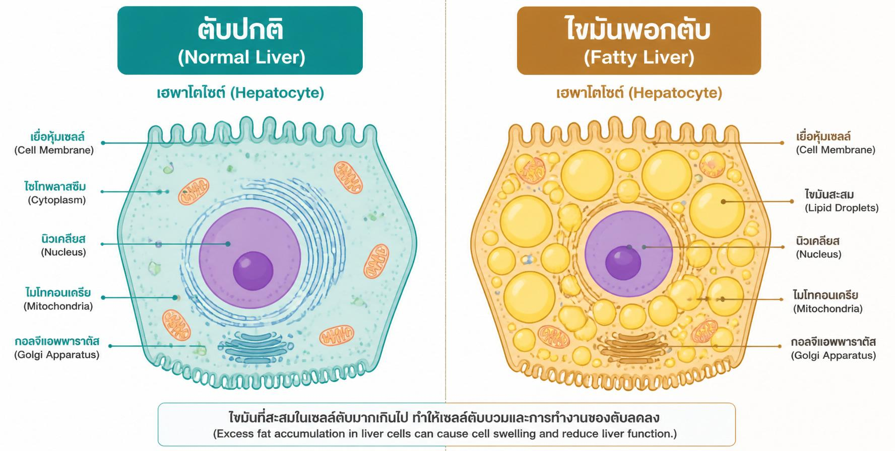
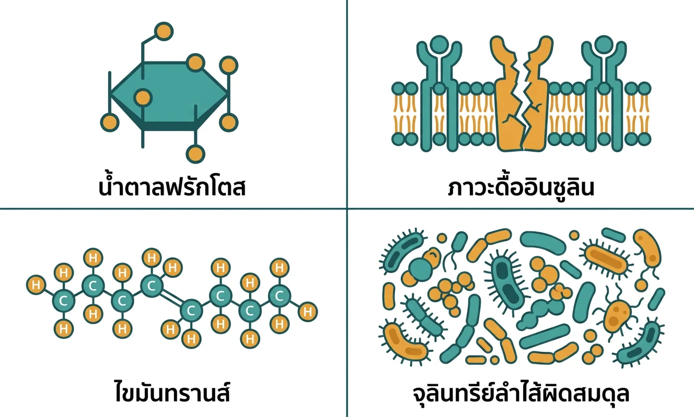
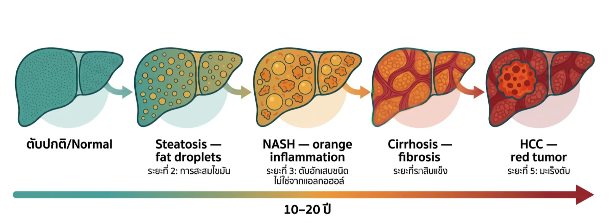

# ไขมันพอกตับ — ที่มาไม่ใช่แค่เหล้า และทำไมมันลุกลามเป็นมะเร็งตับได้

<!-- SEO Metadata -->
<!-- Title tag: ไขมันพอกตับ ที่มาไม่ใช่แค่เหล้า — เส้นทางสู่มะเร็งตับ (56 chars) -->
<!-- Meta description: ไขมันพอกตับเกิดจากน้ำตาล ไขมันทรานส์ และภาวะดื้ออินซูลิน ไม่ใช่แค่แอลกอฮอล์ เรียนรู้เส้นทางลุกลาม และวิธีตรวจก่อนสาย (128 chars) -->
<!-- URL slug: /blog/non-alcoholic-fatty-liver-real-causes -->
<!-- Target keyword: ไขมันพอกตับ ไม่ดื่มเหล้า สาเหตุที่แท้จริง -->
<!-- Secondary keywords: ไขมันพอกตับ จากน้ำตาล, NAFLD สาเหตุ, ไขมันพอกตับ ลุกลามเป็นมะเร็ง, ตับอักเสบที่ไม่ใช่จากแอลกอฮอล์, วิธีดูแลตับ -->
<!-- Author: ทีมแพทย์เวชศาสตร์เชิงฟังก์ชัน, Thrive Wellness Center -->
<!-- Date published: 2026-06-07 -->
<!-- Date modified: 2026-06-07 -->

<!-- DEV NOTE: CTA link = /check-up | Label = "ตรวจสุขภาพตับแบบครบวงจรที่ Thrive →"
     Secondary internal link = /urine-organic-test (gut-liver axis section)
     Wire both to sticky CTA component. Responsive mobile/iPad/desktop.
     Visible within first 3 viewport-heights on page load.
     Set ctaService field in Sanity to: Check-up service document. -->

---

<!-- IMAGE PROMPT (Hero — lifestyle editorial):
Lifestyle editorial photography style. A Thai woman or man, mid-30s to mid-40s,
sitting at a warm Bangkok café or home kitchen table in the morning. In front of
them: a glass of Thai iced tea (ชาเย็น) and a plate of white rice or typical Thai
breakfast. They are looking down at their phone with a quietly thoughtful, slightly
concerned expression — as if reading unexpected health results. Warm amber morning
light coming from the side. Shallow depth of field, food slightly out of focus in
foreground. Mood: calm recognition, not alarm — "I had no idea this was affecting
my liver." Color grade: warm teal-amber tones. No hospital settings, no
stethoscopes, no pill bottles, no obvious AI-generated faces, no stock-photo
white backgrounds. 1200×630px landscape.
-->

---

**สรุปสั้น ๆ**
- ไขมันพอกตับไม่ได้เกิดจากแอลกอฮอล์เพียงอย่างเดียว — น้ำตาล ข้าวขาว และภาวะดื้ออินซูลินคือต้นเหตุหลักที่มักถูกมองข้าม
- ในกลุ่มคนไทยที่เข้าตรวจสุขภาพ เกือบ **45%** มีภาวะไขมันในตับ [2]
- ไขมันพอกตับที่ไม่ได้รับการดูแลสามารถลุกลามเป็นตับอักเสบ (NASH) → ตับแข็ง → มะเร็งตับได้ใน 10–15 ปี
- ระยะแรกแทบไม่มีอาการ — การตรวจเลือดประจำปีคือวิธีเดียวที่รู้ก่อนสาย
- หยุดการลุกลามได้ด้วยการปรับอาหาร ออกกำลังกาย และดูแลสุขภาพลำไส้

---

## สารบัญ

1. [ไขมันพอกตับคืออะไร?](#what-is-fatty-liver)
2. [สาเหตุที่แท้จริง: ไม่ใช่แค่แอลกอฮอล์](#real-causes)
3. [เส้นทางจากไขมันพอกตับสู่มะเร็ง](#progression)
4. [สัญญาณเตือนที่ควรรู้](#warning-signs)
5. [ตรวจและดูแลตับด้วยแนวทาง Functional Medicine](#testing)
6. [มุมมองจากคุณหมอที่ Thrive](#doctors-say)
7. [FAQ](#faq)
8. [References](#references)

---

---
**อยากรู้ว่าตับของคุณสะสมไขมันอยู่ไหม?**
[ตรวจสุขภาพตับแบบครบวงจรที่ Thrive →](/check-up)
*Thrive Wellness Center Bangkok — เวชศาสตร์เชิงฟังก์ชัน ดูแลเฉพาะบุคคล*

---

ไขมันพอกตับไม่ใช่โรคของคนดื่มเหล้าเท่านั้น — คนไม่ดื่ม ไม่อ้วน และดูแลสุขภาพก็เป็นได้ เพราะตัวกระตุ้นหลักคือภาวะดื้ออินซูลินและน้ำตาลส่วนเกิน ซึ่งซ่อนอยู่ในอาหารประจำวันของคนไทยโดยที่หลายคนยังไม่รู้ตัว

---

## ไขมันพอกตับคืออะไร — และทำไมมันถึงเป็น "ภัยเงียบ" {#what-is-fatty-liver}

<!-- IMAGE PROMPT (Inline 1 — ใต้ H2 "ไขมันพอกตับคืออะไร"):
Side-by-side medical diagram. Left: healthy liver cell (hepatocyte) with clear
cytoplasm, labelled "ตับปกติ" with small English subtitle "Normal". Right:
hepatocyte with multiple large lipid droplets filling the cell, labelled
"ไขมันพอกตับ" / "Fatty Liver". Flat illustration style, clean lines. Thrive teal
#2A9D8F accent on healthy side, warm amber on fatty side. Thai primary labels,
small English subtitles. Clean off-white background. No people, no decorative
elements. 1000×500px.
-->

**ไขมันพอกตับ (Fatty Liver Disease) คือภาวะที่ไขมันสะสมในเซลล์ตับมากกว่า 5% ของน้ำหนักตับ** ในระยะแรก ตับยังทำงานได้ตามปกติและผู้ป่วยแทบไม่รู้สึกอะไรเลย นั่นคือเหตุผลที่โรคนี้ได้ชื่อว่า "ภัยเงียบ"

แพทย์แบ่งไขมันพอกตับออกเป็นสองประเภทหลัก ชนิดที่เกิดจากแอลกอฮอล์ (ALD) และชนิดที่ไม่ได้เกิดจากแอลกอฮอล์ (NAFLD — Non-Alcoholic Fatty Liver Disease) ปัจจุบันนักวิชาการนิยมเรียกกลุ่มหลังว่า MAFLD (Metabolic dysfunction-Associated Fatty Liver Disease) เพื่อเน้นว่าต้นเหตุคือความผิดปกติของระบบเมตาบอลิซึม (กระบวนการแปลงอาหารเป็นพลังงานของร่างกาย)

> **ตัวเลขที่น่าตกใจ:** การศึกษาในกลุ่มคนไทยที่เข้าตรวจสุขภาพพบว่า **44.5% มีภาวะไขมันในตับ** และ 98.6% ของกลุ่มนี้เข้าเกณฑ์ MAFLD [2] นั่นหมายความว่าเกือบครึ่งหนึ่งของคนที่ดูแข็งแรงดีอาจมีปัญหาตับโดยไม่รู้ตัว

ในระดับโลก อุบัติการณ์ NAFLD เพิ่มขึ้นกว่า **50% ในช่วง 30 ปีที่ผ่านมา** โดยเอเชียคิดเป็น 57.2% ของผู้ป่วย NAFLD ทั้งหมดบนโลก [1]

---

## สาเหตุที่แท้จริง: ไม่ใช่แค่แอลกอฮอล์ {#real-causes}

<!-- IMAGE PROMPT (Inline 2 — ใต้ H2 "สาเหตุที่แท้จริง"):
Flat-vector infographic with 4 icon tiles arranged in a 2×2 grid on white
background. Each tile has an icon, Thai primary label, and small English subtitle:
(1) sugar crystal icon — "น้ำตาลฟรักโตส" / "Fructose & Sugar",
(2) broken insulin receptor — "ภาวะดื้ออินซูลิน" / "Insulin Resistance",
(3) trans fat molecule — "ไขมันทรานส์" / "Trans Fats",
(4) gut bacteria cluster — "จุลินทรีย์ลำไส้ผิดสมดุล" / "Gut Dysbiosis".
Teal #2A9D8F and warm amber accent colors. Simple, clean lines. No stock-photo
people, no gradients. 1000×600px landscape.
-->

หลายคนเข้าใจผิดว่าไขมันพอกตับเป็นโรคของคนดื่มเหล้า แต่ NAFLD เกิดจากปัจจัยเมตาบอลิกที่หลายคนเผชิญอยู่ในชีวิตประจำวัน

### น้ำตาลฟรักโตส — ศัตรูที่ซ่อนอยู่ในอาหารไทย

**ฟรักโตส (fructose) คือน้ำตาลที่ร่างกายต้องส่งไปแปรรูปที่ตับโดยตรง** ต่างจากกลูโคสที่ถูกใช้ได้ทั่วร่างกาย เมื่อรับฟรักโตสมากเกินไป ตับจะแปลงส่วนเกินให้กลายเป็นไขมัน ผ่านกระบวนการที่เรียกว่า de novo lipogenesis (การสร้างไขมันใหม่) งานวิจัยพบว่าการบริโภคน้ำตาลและฟรักโตสในปริมาณสูงสัมพันธ์โดยตรงกับการเพิ่มขึ้นของไขมันในตับ [3]

อาหารและเครื่องดื่มไทยยอดนิยมหลายชนิดมีฟรักโตสสูงกว่าที่คิด ไม่ว่าจะเป็นชาเย็น ชานมไข่มุก น้ำผลไม้คั้นสด น้ำจิ้มซีฟู้ด และอาหารที่ปรุงด้วยน้ำตาลปี๊บ ล้วนส่งฟรักโตสเข้าตับในปริมาณที่ร่างกายรับมือได้ยาก

### ภาวะดื้ออินซูลิน — จุดศูนย์กลางของปัญหา

**อินซูลิน (insulin) คือฮอร์โมนที่ช่วยนำน้ำตาลจากเลือดเข้าสู่เซลล์** เมื่อร่างกายดื้อต่ออินซูลิน (insulin resistance — ภาวะที่เซลล์ตอบสนองต่ออินซูลินลดลง) ตับจะถูกสั่งให้ผลิตไขมันมากขึ้นและสลายไขมันน้อยลง ภาวะนี้พบบ่อยในผู้ที่กินข้าวขาวและแป้งขัดสีในปริมาณสูง นอนพักผ่อนไม่เพียงพอ หรือออกกำลังกายน้อย

### ไขมันทรานส์และไขมันอิ่มตัวสูง

ไขมันทรานส์ (trans fat) จากอาหารทอดซ้ำ เบเกอรี่ และครีมเทียม กระตุ้นให้ตับสร้างไขมันสะสมเพิ่มขึ้น รวมถึงยังเพิ่มการอักเสบ (inflammation — การที่ระบบภูมิคุ้มกันถูกกระตุ้นเรื้อรัง) ซึ่งเป็นปัจจัยเร่งการลุกลามของโรค

### ความผิดปกติของจุลินทรีย์ในลำไส้ (Gut Dysbiosis)

งานวิจัยปัจจุบันพบว่าแบคทีเรียในลำไส้มีบทบาทสำคัญต่อสุขภาพตับโดยตรง ผ่านสิ่งที่เรียกว่า "gut-liver axis" (แกนลำไส้-ตับ) เมื่อความสมดุลของจุลินทรีย์ถูกรบกวน ผนังลำไส้จะสูญเสียความแน่นหนา สารพิษจากแบคทีเรียรั่วเข้าสู่กระแสเลือดและไปถึงตับ กระตุ้นให้เกิดการอักเสบเรื้อรัง [5]

---

## เส้นทางจากไขมันพอกตับสู่มะเร็ง {#progression}

<!-- IMAGE PROMPT (Inline 3 — ใต้ H2 "เส้นทางจากไขมันพอกตับสู่มะเร็ง"):
Horizontal 5-stage flowchart with arrows connecting each stage. Each stage
displays a simplified liver cross-section with increasing damage and a label:
(1) ตับปกติ / Normal — clean teal liver,
(2) ไขมันพอกตับ / Steatosis — amber fat droplets visible,
(3) NASH / Steatohepatitis — orange inflammation dots,
(4) ตับแข็ง / Cirrhosis — dark grey fibrosis texture,
(5) มะเร็งตับ / HCC — deep red tumor mass.
Timeline label "10–20 ปี" displayed below the arrow sequence.
Color progression: teal → amber → orange → dark grey → deep red.
Thai primary labels, small English subtitles. Clean flat illustration,
off-white background. No people. 1200×450px wide landscape.
-->

นี่คือส่วนที่หลายคนยังไม่รู้ ไขมันพอกตับที่ปล่อยทิ้งไว้ไม่ได้แค่ "คงที่" — มันลุกลามได้เป็นขั้นตอน

**ระยะที่ 1 — Simple Steatosis (ไขมันพอกตับเฉย ๆ)**
ตับสะสมไขมันเกิน 5% แต่ยังไม่มีการอักเสบ ไม่มีอาการ ค่าตับในเลือดอาจปกติหรือสูงเล็กน้อย ระยะนี้ยังแก้ไขได้หากเริ่มปรับพฤติกรรมทันที

**ระยะที่ 2 — NASH (ตับอักเสบที่ไม่ได้มาจากแอลกอฮอล์)**
ไขมันในตับกระตุ้นให้เกิดการอักเสบและเซลล์ตับเริ่มถูกทำลาย ประมาณ **20–25%** ของผู้ที่มี NAFLD จะลุกลามถึงระยะนี้

**ระยะที่ 3 — Fibrosis และ Cirrhosis (พังผืดและตับแข็ง)**
เซลล์ตับที่ถูกทำลายถูกแทนที่ด้วยพังผืด (fibrosis) ซึ่งลดความสามารถในการทำงานของตับลงเรื่อย ๆ จนกลายเป็นตับแข็ง (cirrhosis — ภาวะที่เนื้อตับถูกแทนที่ด้วยแผลเป็นถาวร) **ความเสี่ยงสะสมของ NAFLD ที่จะลุกลามถึงตับแข็งอยู่ที่ 39% ภายใน 8 ปี** [4]

> **ข้อมูลสำคัญ:** การศึกษาในฐานข้อมูลผู้ป่วย 18 ล้านคนจาก 4 ประเทศยุโรปพบว่าการวินิจฉัยเบาหวานเป็นปัจจัยทำนายที่แข็งแกร่งที่สุดสำหรับการลุกลามเป็นตับแข็งและมะเร็งตับในผู้ป่วย NAFLD [4]

**ระยะที่ 4 — HCC (มะเร็งตับ)**
ตับแข็งเพิ่มความเสี่ยงมะเร็งตับ (hepatocellular carcinoma — มะเร็งที่เกิดในเนื้อตับโดยตรง) อย่างมีนัยสำคัญ ในกลุ่ม NASH ที่มีตับแข็ง **4–27% พัฒนาเป็นมะเร็งตับ** [4]

---

## สัญญาณเตือนที่ควรรู้ — และที่ร่างกายไม่บอก {#warning-signs}

**ปัญหาที่ใหญ่ที่สุดของไขมันพอกตับคือการไม่แสดงอาการในระยะแรก** กว่าจะรู้สึกถึงความผิดปกติ โรคอาจลุกลามไปมากแล้ว

อาการที่อาจเกิดขึ้นในระยะกลาง-ปลาย:
- อ่อนเพลียเรื้อรังโดยไม่มีเหตุชัดเจน
- ปวดหรือรู้สึกหนักตรงบริเวณชายโครงขวา
- ท้องอืด แน่นท้องบ่อย หลังกินอาหาร
- คลื่นไส้หรือเบื่ออาหาร

**กลุ่มที่ควรตรวจพิเศษ แม้ยังไม่มีอาการ:**
- มีน้ำหนักเกินหรือรอบเอวใหญ่ (ผู้ชาย > 90 ซม. / ผู้หญิง > 80 ซม.)
- เป็นเบาหวานหรืออยู่ในกลุ่มก่อนเบาหวาน (pre-diabetes)
- มีไขมันในเลือดสูง โดยเฉพาะ triglycerides สูงและ HDL ต่ำ
- ความดันโลหิตสูง
- กินน้ำตาลหรือแป้งขัดสีในปริมาณมากเป็นประจำ
- ออกกำลังกายน้อยกว่า 150 นาทีต่อสัปดาห์

> **สิ่งที่หลายคนในประเทศไทยไม่รู้:** แม้ BMI ปกติก็เป็นไขมันพอกตับได้ เพราะชาวเอเชียมีแนวโน้มสะสมไขมันในอวัยวะภายใน (visceral fat — ไขมันรอบอวัยวะในช่องท้อง) มากกว่าคนตะวันตกที่น้ำหนักเท่ากัน การศึกษาในประชากรไทยพบว่า 2.8% เป็น lean NAFLD (BMI < 23) โดยไม่มีอาการใดเลย [2]

*ปรึกษาแพทย์ก่อนเริ่มโปรแกรมดูแลตับหรือปรับเปลี่ยนอาหาร โดยเฉพาะหากมีโรคประจำตัว*

---

## ตรวจและดูแลตับด้วยแนวทาง Functional Medicine {#testing}

แนวทางเวชศาสตร์เชิงฟังก์ชัน (functional medicine — การแพทย์ที่มุ่งหาต้นเหตุของโรค ไม่ใช่แค่รักษาอาการ) มองไขมันพอกตับเป็นสัญญาณของความผิดปกติเชิงระบบ ไม่ใช่ปัญหาของตับเพียงอย่างเดียว

### การตรวจที่แนะนำ

**ค่าตับพื้นฐาน:**
- ALT, AST, GGT — ค่าเอนไซม์ตับที่บ่งบอกการอักเสบและความเสียหาย
- Alkaline Phosphatase (ALP) และ Bilirubin

**มาร์กเกอร์เมตาบอลิซึม (ดูต้นเหตุ ไม่ใช่แค่ผล):**
- Fasting insulin + Fasting glucose + HbA1c — ตรวจภาวะดื้ออินซูลิน
- Lipid panel: Triglycerides, HDL, LDL, Total Cholesterol
- Uric acid — สัมพันธ์กับการบริโภคฟรักโตสสูง

**การประเมินสุขภาพลำไส้:**
สำหรับผู้ที่มีอาการลำไส้เรื้อรัง เช่น ท้องอืด อุจจาระผิดปกติ หรือสงสัยปัญหา gut dysbiosis การตรวจ [Organic Acids Test (OAT) ผ่านปัสสาวะ](/urine-organic-test) ช่วยประเมินความสมดุลของแบคทีเรียในลำไส้และเชื้อยีสต์ที่อาจส่งผลต่อ gut-liver axis ได้

**อัลตราซาวด์ตับ:**
ใช้ยืนยันภาวะไขมันพอกตับและประเมินระดับความรุนแรงเบื้องต้น

### แนวทางชีวิตที่มีหลักฐานรองรับ

- **ลดน้ำตาลและฟรักโตส** โดยเฉพาะเครื่องดื่มหวาน น้ำผลไม้คั้น และอาหารแปรรูป
- **เลือกคาร์โบไฮเดรตชนิดซับซ้อน** ข้าวกล้อง มันเทศ ข้าวโอ๊ต แทนข้าวขาวและแป้งขัดสี
- **ออกกำลังกายสม่ำเสมอ** อย่างน้อย 150 นาทีต่อสัปดาห์ — cardio และ resistance training ช่วยลดไขมันในตับได้โดยตรง
- **นอนหลับให้ครบ 7–9 ชั่วโมง** การนอนน้อยเพิ่มความเสี่ยงภาวะดื้ออินซูลิน
- **ดูแลสุขภาพลำไส้** รับประทานอาหารที่มีไฟเบอร์สูง และลดอาหารแปรรูปที่ทำลายความหลากหลายของจุลินทรีย์ในลำไส้

---

## มุมมองจากคุณหมอที่ Thrive {#doctors-say}

"สิ่งที่เราพบบ่อยในคลินิกคือคนไข้ที่ได้รับการวินิจฉัยไขมันพอกตับโดยบังเอิญระหว่างตรวจสุขภาพประจำปี ส่วนใหญ่ไม่ดื่มเหล้าและไม่ได้อ้วน แต่เมื่อตรวจเมตาบอลิซึมเพิ่มเติม มักพบภาวะดื้ออินซูลิน ไตรกลีเซอไรด์สูง หรือ fasting insulin ที่ไม่เหมาะสม ซึ่งเป็นสัญญาณว่าร่างกายกำลังจัดการน้ำตาลและไขมันได้ไม่ดี

แนวทางของเราคือดูต้นเหตุ ไม่ใช่แค่ตัวเลข — ปรับอาหาร ออกกำลังกาย และดูแลสุขภาพลำไส้ไปพร้อมกัน ผลลัพธ์ที่เราเห็นบ่อยคือค่าตับที่กลับมาอยู่ในเกณฑ์ปกติภายใน 3–6 เดือน เมื่อแก้ต้นเหตุได้ถูกจุด"

— ทีมแพทย์เวชศาสตร์เชิงฟังก์ชัน, Thrive Wellness Center, กรุงเทพฯ

---

## คำถามที่พบบ่อย {#faq}

**ไม่ดื่มเหล้าและไม่อ้วนเลย ยังเป็นไขมันพอกตับได้ไหม?**
ได้ค่ะ/ครับ งานวิจัยในประชากรไทยพบว่าแม้น้ำหนักปกติ (BMI < 23) ก็สามารถมีไขมันพอกตับได้ เรียกว่า lean NAFLD ต้นเหตุมักเป็นการกินน้ำตาลและแป้งขัดสีสูง ภาวะดื้ออินซูลิน หรือความผิดปกติของจุลินทรีย์ในลำไส้ [2]

**ไขมันพอกตับรักษาหายได้ไหม?**
ในระยะแรก (simple steatosis) ไขมันพอกตับสามารถลดลงและกลับสู่ปกติได้ด้วยการปรับพฤติกรรม การลดน้ำหนัก 5–10% มีหลักฐานว่าช่วยลดไขมันในตับได้อย่างมีนัยสำคัญ อย่างไรก็ตามควรปรึกษาแพทย์เพื่อประเมินระยะและวางแผนที่เหมาะสมกับคุณ

**ค่าตับปกติ แปลว่าไม่เป็นไขมันพอกตับใช่ไหม?**
ไม่เสมอไปค่ะ/ครับ ในระยะแรก ค่า ALT และ AST อาจอยู่ในเกณฑ์ปกติได้ แม้ตับจะสะสมไขมันอยู่ การตรวจอัลตราซาวด์ร่วมกับ fasting insulin และ lipid panel ให้ภาพที่ครบกว่าค่าตับอย่างเดียว

**ควรตรวจบ่อยแค่ไหน?**
สำหรับกลุ่มเสี่ยง (น้ำหนักเกิน เบาหวาน ไขมันในเลือดสูง) แนะนำตรวจค่าตับและมาร์กเกอร์เมตาบอลิซึมปีละครั้ง สำหรับผู้ที่ได้รับการวินิจฉัยแล้ว ความถี่ขึ้นอยู่กับระยะโรคและคำแนะนำของแพทย์

**ปัจจุบันมียารักษาไขมันพอกตับไหม?**
ยังไม่มียาที่ได้รับการรับรองสำหรับ NAFLD/NASH โดยเฉพาะ (ณ ปี 2026 มียาบางตัวอยู่ในระยะการศึกษาวิจัย) การปรับพฤติกรรมยังคงเป็นแนวทางหลักที่มีหลักฐานรองรับมากที่สุด ปรึกษาแพทย์ก่อนรับประทานอาหารเสริมหรือสมุนไพรที่โฆษณาว่าบำรุงตับ เพราะบางชนิดอาจส่งผลเสียต่อตับได้

---

---
**สงสัยว่าตับของคุณสะสมไขมันอยู่ไหม?**
[ตรวจสุขภาพตับแบบครบวงจรที่ Thrive →](/check-up)
*ตรวจค่าตับ มาร์กเกอร์เมตาบอลิซึม และประเมินโดยแพทย์เวชศาสตร์เชิงฟังก์ชัน*
*LINE @thrivewellnessth | โทร 095-934-9640*

---

## References {#references}

[1] Riazi, K., Azhari, H., Charette, J.H., et al. (2022). The prevalence and incidence of NAFLD worldwide: a systematic review and meta-analysis. *The Lancet Gastroenterology & Hepatology*, 9(7). https://pmc.ncbi.nlm.nih.gov/articles/PMC10026948/

[2] Jirapinyo, P., et al. (2025). Metabolic dysfunction-associated fatty liver disease (MAFLD) in the adult population attending a health check-up program in Thailand: prevalence and fibrosis status. *Scientific Reports*. https://www.nature.com/articles/s41598-025-06874-1

[3] Basaranoglu, M., et al. (2022). Added Fructose in Non-Alcoholic Fatty Liver Disease and in Metabolic Syndrome: A Narrative Review. *Nutrients*. https://www.ncbi.nlm.nih.gov/pmc/articles/PMC8950441/

[4] Hagström, H., Nasr, P., Ekstedt, M., et al. (2019). Risks and clinical predictors of cirrhosis and hepatocellular carcinoma diagnoses in adults with diagnosed NAFLD: real-world study of 18 million patients in four European cohorts. *BMC Medicine*, 17(1), 95. https://bmcmedicine.biomedcentral.com/articles/10.1186/s12916-019-1321-x

[5] Duan, Y., et al. (2022). Gut–Liver Axis and Non-Alcoholic Fatty Liver Disease: A Vicious Circle of Dysfunctions Orchestrated by the Gut Microbiome. *Biology*, 11(11), 1622. https://pmc.ncbi.nlm.nih.gov/articles/PMC9687983/

[6] Pothong, K., et al. (2017). Gender differences in the prevalence of nonalcoholic fatty liver disease in the Northeast of Thailand. *Asian Pacific Journal of Cancer Prevention*. https://www.ncbi.nlm.nih.gov/pmc/articles/PMC5645706/

---

<!-- ============================================================
IMAGE PROMPTS SUMMARY
============================================================

| # | Filename | Size | Placement | Prompt |
|---|---|---|---|---|
| Hero | non-alcoholic-fatty-liver-hero.webp | 1200×630 | Above H1 | Lifestyle editorial. Thai person mid-30s–40s at Bangkok café/kitchen, morning. Thai iced tea + white rice in foreground (soft focus). Looking at phone with quietly thoughtful, mildly concerned expression. Warm amber side-lighting. Shallow depth of field. Mood: calm recognition, not alarm. Warm teal-amber color grade. No hospitals, no stethoscopes, no pill bottles, no AI-generated faces. 1200×630px. |
| Inline 1 | fatty-liver-vs-normal-liver-diagram.webp | 1000×500 | After H2: ไขมันพอกตับคืออะไร | Side-by-side hepatocyte diagram. Left: clear cytoplasm "ตับปกติ/Normal" in teal. Right: lipid droplets filling cell "ไขมันพอกตับ/Fatty Liver" in amber. Flat illustration, clean lines. Off-white background. Thai + English labels. No people. 1000×500px. |
| Inline 2 | nafld-non-alcohol-causes-infographic.webp | 1000×600 | After H2: สาเหตุที่แท้จริง | 2×2 flat-vector icon grid: (1) sugar crystal "น้ำตาลฟรักโตส/Fructose", (2) broken insulin receptor "ภาวะดื้ออินซูลิน/Insulin Resistance", (3) trans fat "ไขมันทรานส์/Trans Fats", (4) gut bacteria "จุลินทรีย์ลำไส้ผิดสมดุล/Gut Dysbiosis". Teal + amber on white. Thai + English labels. No people. 1000×600px. |
| Inline 3 | nafld-to-liver-cancer-progression-diagram.webp | 1200×450 | After H2: เส้นทางจากไขมันพอกตับสู่มะเร็ง | Horizontal 5-stage flowchart: (1) ตับปกติ/Normal teal, (2) Steatosis amber fat droplets, (3) NASH orange inflammation, (4) Cirrhosis dark grey fibrosis, (5) HCC deep red tumor. Timeline "10–20 ปี" below. Teal→red progression. Thai + English labels. No people. 1200×450px. |

============================================================
STRUCTURED DATA
============================================================
{
  "@context": "https://schema.org",
  "@graph": [
    {
      "@type": "BlogPosting",
      "headline": "ไขมันพอกตับ — ที่มาไม่ใช่แค่เหล้า และทำไมมันลุกลามเป็นมะเร็งตับได้",
      "description": "ไขมันพอกตับเกิดจากน้ำตาล ไขมันทรานส์ และภาวะดื้ออินซูลิน ไม่ใช่แค่แอลกอฮอล์ เรียนรู้เส้นทางลุกลาม และวิธีตรวจก่อนสาย",
      "image": "https://thrivewellnessth.com/blog/non-alcoholic-fatty-liver-hero.webp",
      "url": "https://thrivewellnessth.com/blog/non-alcoholic-fatty-liver-real-causes",
      "datePublished": "2026-06-07",
      "author": { "@type": "Organization", "name": "Thrive Wellness Center", "url": "https://thrivewellnessth.com" },
      "publisher": { "@type": "Organization", "name": "Thrive Wellness Center", "logo": { "@type": "ImageObject", "url": "https://thrivewellnessth.com/logo.png" } },
      "inLanguage": "th",
      "keywords": "ไขมันพอกตับ, NAFLD, ไขมันพอกตับ ไม่ดื่มเหล้า, ตับอักเสบ, NASH, มะเร็งตับ, functional medicine Bangkok"
    },
    {
      "@type": "FAQPage",
      "mainEntity": [
        { "@type": "Question", "name": "ไม่ดื่มเหล้าและไม่อ้วนเลย ยังเป็นไขมันพอกตับได้ไหม?", "acceptedAnswer": { "@type": "Answer", "text": "ได้ค่ะ/ครับ งานวิจัยในประชากรไทยพบว่าแม้น้ำหนักปกติ (BMI < 23) ก็สามารถมีไขมันพอกตับได้ ต้นเหตุมักเป็นการกินน้ำตาลและแป้งขัดสีสูง ภาวะดื้ออินซูลิน หรือความผิดปกติของจุลินทรีย์ในลำไส้" } },
        { "@type": "Question", "name": "ไขมันพอกตับรักษาหายได้ไหม?", "acceptedAnswer": { "@type": "Answer", "text": "ในระยะแรก ไขมันพอกตับสามารถลดลงและกลับสู่ปกติได้ด้วยการปรับพฤติกรรม การลดน้ำหนัก 5–10% มีหลักฐานว่าช่วยลดไขมันในตับได้อย่างมีนัยสำคัญ" } },
        { "@type": "Question", "name": "ค่าตับปกติ แปลว่าไม่เป็นไขมันพอกตับใช่ไหม?", "acceptedAnswer": { "@type": "Answer", "text": "ไม่เสมอไป ในระยะแรก ค่า ALT และ AST อาจอยู่ในเกณฑ์ปกติได้ แม้ตับจะสะสมไขมันอยู่ การตรวจอัลตราซาวด์ร่วมกับ fasting insulin และ lipid panel ให้ภาพที่ครบกว่า" } },
        { "@type": "Question", "name": "ควรตรวจบ่อยแค่ไหน?", "acceptedAnswer": { "@type": "Answer", "text": "สำหรับกลุ่มเสี่ยง แนะนำตรวจค่าตับและมาร์กเกอร์เมตาบอลิซึมปีละครั้ง" } },
        { "@type": "Question", "name": "ปัจจุบันมียารักษาไขมันพอกตับไหม?", "acceptedAnswer": { "@type": "Answer", "text": "ยังไม่มียาที่ได้รับการรับรองสำหรับ NAFLD/NASH โดยเฉพาะ ณ ปี 2026 การปรับพฤติกรรมยังคงเป็นแนวทางหลักที่มีหลักฐานรองรับมากที่สุด" } }
      ]
    }
  ]
}

============================================================
PUBLISHING CHECKLIST
============================================================
- [ ] Title tag + meta description set in Sanity SEO fields
- [ ] URL slug: /blog/non-alcoholic-fatty-liver-real-causes
- [ ] Structured data (BlogPosting + FAQPage) added
- [ ] Hero image uploaded (non-alcoholic-fatty-liver-hero.webp) — set as OG image
- [ ] 3 inline images uploaded, alt text set, lazy-loaded
- [ ] TOC anchor links verified
- [ ] Internal links live: /check-up and /urine-organic-test
- [ ] Canonical URL set to self
- [ ] Mobile rendering verified
- [ ] ctaService field in Sanity → Check-up service document
============================================================ -->
